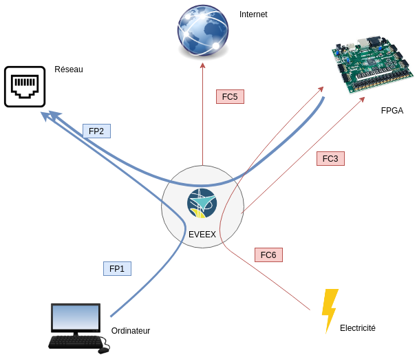
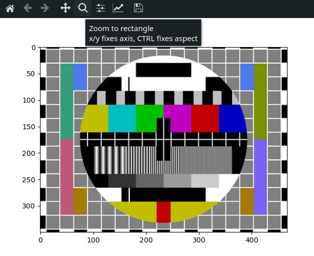
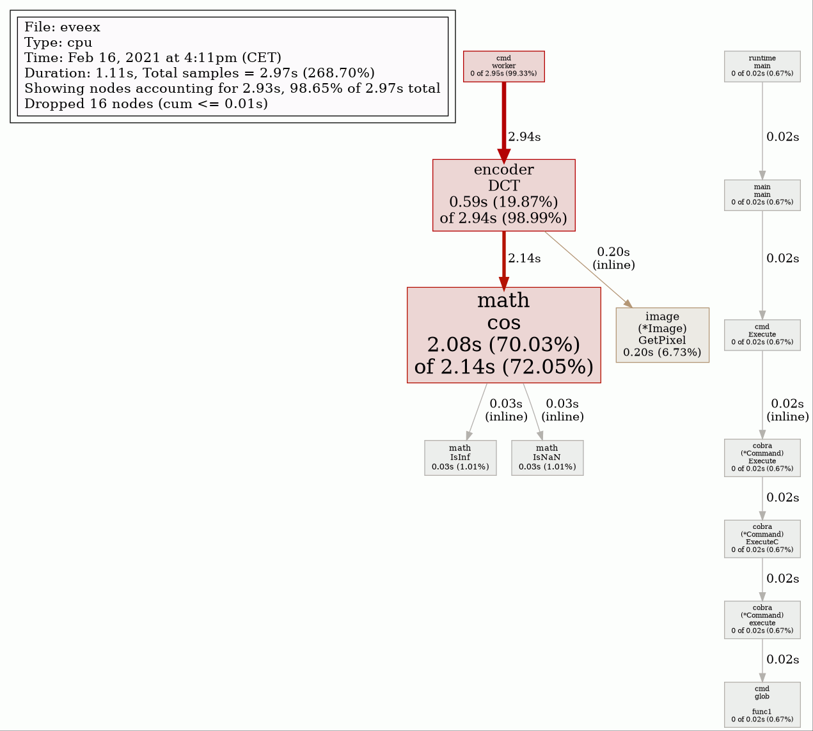
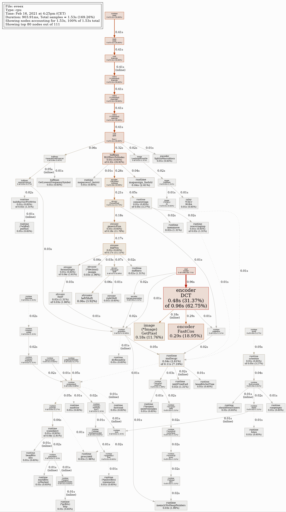
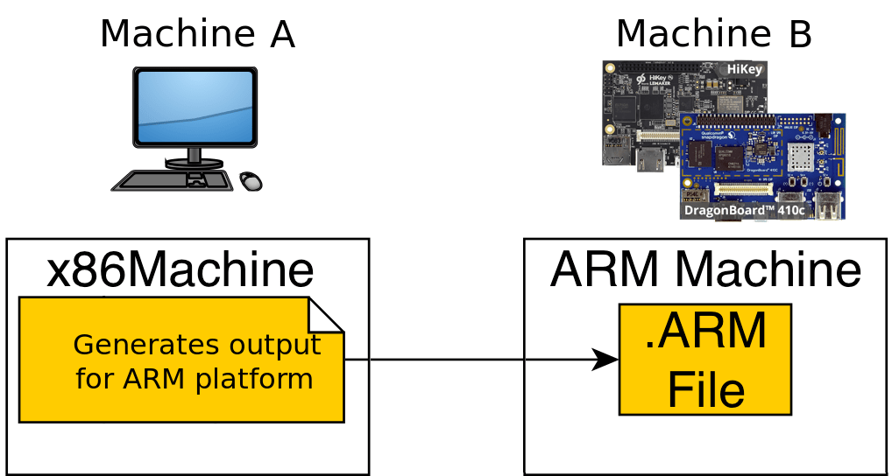
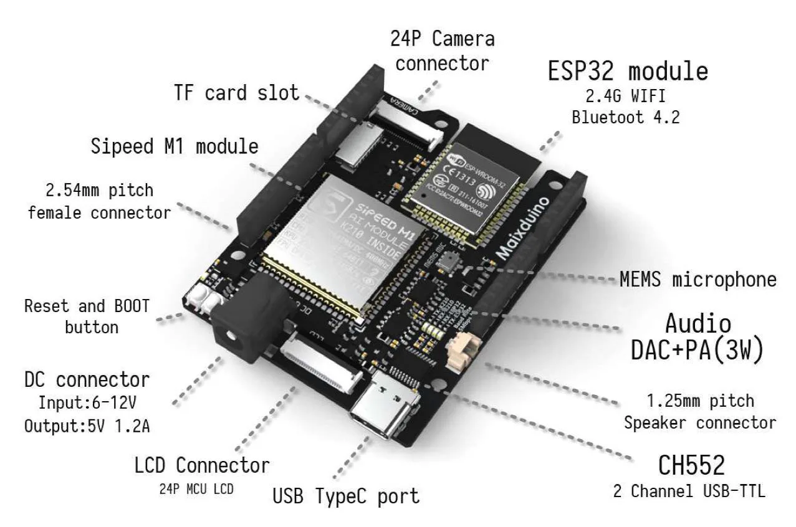
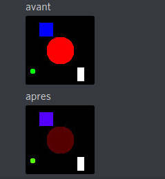
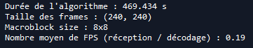
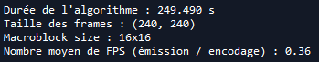

# Généralités

**Membres du groupe** : 

*   Guillaume Leinen (guillaume.leinen@ensta-bretagne.org)
*   Jean-Noël Clink (jean-noel.clink@ensta-bretagne.org)
*   Hussein Saad (hussein.saad@ensta-bretagne.org)
*   Alexandre Froehlich (alexandre.froehlich@ensta-bretagne.org)
*   Hugo Questroy (hugo.questroy@ensta-bretagne.org)

**Encadrants du projet** : 

*   Pascal Cotret (pascal.cotret@ensta-bretagne.fr)
*   Jean-Christophe Le Lann (jean-christophe.le_lann@ensta-bretagne.fr)
*   Joël Champeau (joel.champeau@ensta-bretagne.fr)

**Liens utiles :**

*   Code source du projet : [https://github.com/EVEEX-Project/EVEEX-Code](https://github.com/EVEEX-Project/EVEEX-Code)
*   Code source de la documentation : [https://github.com/EVEEX-Project/EVEEX-Documentation](https://github.com/EVEEX-Project/EVEEX-Documentation)

*   Eportfolio Mahara : [https://mahara.ensta-bretagne.fr/view/groupviews.php?group=348](https://mahara.ensta-bretagne.fr/view/groupviews.php?group=348)

# Abstract

Most of the world's bandwidth is now used for multimedia content exchange, especially video streaming. With more than 2 billion users each month on YouTube alone **[1]**, video streaming has become a technology that is taken for granted, but consumes a lot of resources, both in terms of energy and storage.To reduce this excessive power-consumpion, one solution is video compression. While corporate consortia compete for royalties on their proprietary compression algorithms such as MPEG or x264, we want to offer a viable, open source alternative.

During this school year, we designed an algorithm to compress a raw video stream,send it over a network or simply store it in a file, and then a second algorithm to decompress that data. Once the algorithm was operational and mature, we sought to implement it on hardware in order to optimize the computation time and energy consumption associated with data compression.

We use several programming languages to build different prototypes in an incremental way. We started with Python to create an algorithm that was easy to understand, then we settled on a C version to optimize its execution, however development difficulties led us to move to another language, Golang. These algorithms have been implemented on a Raspberry Pi, however we have to wait for an update of the Golang compiler to support 32 bits riscv before seeing an efficient FPGA implementation.

It is obvious that to achieve these steps, we could not rely on too many existing software libraries for reasons of portability of the code to different languages and then to different platforms.
At the moment, the algorithm is able, based on Python language and on a Raspberry Pi, to encode, send via the network and decode images or a video stream in a synchronized way (decoding *on the fly*).

# Résumé

La majeure partie de la bande passante mondiale est aujourd’hui utilisée pour l’échange de contenu multimédia, en particulier le streaming vidéo. Avec plus de 2 milliards d’utilisateurs chaque mois sur YouTube seulement **[1]**, le streaming vidéo est devenu une technologie considérée comme acquise, mais qui consomme beaucoup de ressources, tant en matière d’énergie que de stockage.

Pour réduire ces consommations excessives, une solution est la compression vidéo. Alors que les consortiums d’entreprises se font concurrence pour les redevances sur leurs algorithmes de compression propriétaires tels que MPEG-1 ou x264, nous voulons offrir une alternative viable et open source.

Au cours de cette année scolaire, nous avons conçu un algorithme pour compresser un flux vidéo brut afin de l’envoyer sur un réseau ou simplement de le stocker dans un fichier, puis un second algorithme pour décompresser ces données. Une fois que l’algorithme était opérationnel et mature, nous avons cherché à l’implémenter sur le matériel afin d’optimiser le temps de calcul et la consommation d’énergie liés à la compression des données.

Nous utilisons plusieurs langages de programmation pour construire différents prototypes de façon incrémentale. Nous avons commencé par Python pour créer un algorithme facile à comprendre, puis nous sommes passés sur une version en C pour optimiser son exécution, cependant des difficultés de développement nous ont amené à nous diriger vers un autre langage, le Golang. Ces algorithmes ont été implémentés sur des Raspberry Pi, il faut cependant attendre une mise a jour du compilateur Golang pour supporter le RISC-V 32 bits avant de voir une implémentation FPGA efficace.

Il est évident que pour réaliser ces étapes, nous ne pouvions pas nous appuyer sur trop de bibliothèques  logicielles existantes pour des raisons de portabilité du code vers différents langages puis vers différentes plateformes.

A l’heure actuelle, l’algorithme est capable, sur base de langage Python et sur une Raspberry Pi, d’encoder, envoyer via le réseau et de décoder des images ou un flux vidéo de manière synchronisée (décodage *on the fly*).

\pagebreak

# Remerciements

Nous n'aurions jamais pu atteindre le niveau de compétences et remplir nos objectifs sans l'aide des acteurs suivants : 

-   Nos encadrants **Pascal Cotret**, **Jean-Christophe Le Lann** et **Joël Champeau**, qui nous aident à définir les objectifs à atteindre, nous prêtent le matériel nécessaire (en particulier les cartes FPGA), ainsi qu'a résoudre des problèmes théoriques.
-   **Hélène Thomas** pour nous avoir prêté du matériel complémentaire pour que l'on puisse mettre à bien la démonstration sur Paspberry Pi.
-   **Enjoy Digital**, société créée par un Alumni Ensta-Bretagne, et son produit Litex qui nous sera très utile sur l'implémentation hardware.
-   Le site **FPGA4students** pour ses tutoriels VHDL/Verilog.
-   **Jean-Christophe Leinen** pour ses conseils sur les méthodes Agiles.

Ainsi nous remercions toutes ces personnes qui ont contribué à notre projet ou bien qui nous ont guidé vers des chemins que nous n'aurions jamais pensé réalisables.

\pagebreak

# Introduction

Dans son rapport annuel sur l'usage d'internet, Cisco met en exergue l'importance du trafic vidéo dans l'internet mondial **[2] [3]** : la part du **streaming** dans le débit mondial ne fait qu'augmenter, les **définitions** et **résolutions** de lecture augmentent elles aussi, ainsi que la part de "**live**" (flux direct) très gourmands en bande passante. 

Dans cette perspective, il est évident qu'un **algorithme de compression** pour compresser un flux vidéo brut à toute son importance. Le moindre pourcent de **bande passante** économisée permet de libérer plusieurs TB/s (terabyte par seconde) de bande passante sans compter l'impact écologique lié à une consommation électrique moins importante. Cependant, il existe une multitude d'algorithmes de compression, appelés "codecs". Ces **codecs** sont relativement peu connus du grand public, en voici une liste non-exhaustive des plus répandus :

* **MPEG-4** (H.264) : il s'agit d'un des codecs les plus connus. Il génère des fichiers d'extension `.mp4` et est embarqué dans un grand nombre d'appareils numériques. Il est important de savoir que, comme le H.265 (vu plus loin), ce codec est **protégé** par un brevet, et les services et constructeurs souhaitant utiliser cet algorithme ou un connecteur basé sur l'algorithme doivent verser des royalties à MPEG-LA **[4]** (*la fabrication d'un connecteur display-port coûte 0.20$ de license au constructeur*), coalitions de plusieurs entreprises du numériques comme Sony, Panasonic ou encore l'université de Columbia. 
* **VPx** : appartenant à l'origine à One-technologie, l'entreprise fut rachetée par Google à la suite. Les codecs VP (dernière version VP9) sont ouverts et sans royalties. Ce codec est plutôt performant en termes de compression, mais son encodage est lent **[5]**. Par exemple, avec un processeur core i7 d'Intel en 720p, la vitesse de compression s'approche de 2 images par seconde, occasionnant des coûts non-négligeables en puissance informatique pour les entreprises productrices de contenu (comme Netflix ou bien YouTube). 
* **H.265** : l'un des codecs les plus récents, et digne successeur du H.264. Il permet une réduction significative de la bande passante nécessaire au flux vidéo, notamment pour le streaming. Cependant, à l'instar du VP9, le H.265 est aussi lent à l'encodage, et demande en plus de verser des royalties de license. 

Vous l'aurez constaté, les codecs les plus actuels sont souvent détenus par des entreprises du secteur. Pour limiter les coûts annexes pour les entreprises, un consortium s'est créé en 2015, a but non lucratif, afin de développer un codec libre de droit aussi efficace que les autres : l'**Aliance for Open-Media** **[6]**. On compte la plupart des acteurs du secteur dans ce consortium, notamment l'arrivée des acteurs du streaming comme Hulu ou Netflix. Leur création, le codec **AV1**, basé sur VP9, est donc libre de droit, et est notamment très employé dans le streaming vidéo. Il a l'avantage de proposer une **compression 30% plus forte** que le H.265 **[7]** mais occasionne, par les différentes bibliothèques utilisées, une utilisation des ressources informatiques (puissance processeur) bien plus importante, aussi bien du coté **encodeur** que **décodeur**. La transition vers l'AV1 sur les grandes plateformes vidéos (Netflix, Youtube) n'est pas encore effectif mais est déjà en cours de réalisation.

Ce besoin en ressources CPU devient critique, et est un point économiquement important pour les entreprises du secteur multimédia. A l'heure actuelle, l'**architecture PC** (jeu d'instruction x64, x86) reste la plus utilisée dans l'informatique moderne, mais cela pourrait changer d'ici quelques années. En effet, les architectures à destination de matériel embarqué ont fait d'immenses progrès ces dernières années, au point que même un géant du secteur comme Apple a décidé de basculer l'ensemble de ses produits vers une **architecture ARM** (cf. un peu plus loin). 

Ces architectures embarquées, plus récentes et profitant des avancées modernes, possèdent en effet des caractéristiques de **consommation** et de **performances** qui les rendent très intéressantes pour le traitement vidéo. Voyons ensemble quelques-unes de ces architectures et technologies actuelles : 

### Architecture ARM

Ce jeu d'instructions est très présent dans les appareils mobiles et embarqués (comme les smartphones ou tablettes). Il a l'avantage de proposer un jeu d'instructions réduit (RISC : Reduced Instruction Set Computer), ce qui permet notamment des **performances** en matières de **consommation d’énergie** très intéressantes en mobilité. En revanche, l'architecture est, tout comme les jeux d'instructions PC plus anciens, **sous licence** (x64 pour AMD, x86 pour Intel). Les *SOC* (System On a Chip) ARM **embarquent** tous les composants nécessaires au fonctionnement du système (CPU : Computer Processing Unit, GPU : Graphical Processing Unit, DSP : Digital Signal Processor, gestions des I/O : Input/Output) sur une seule puce ce qui rend ces systèmes extrêmement compacts. Le jeu d'instructions réduit en revanche l**’inter-compatibilité** entre x64/86 et les architectures de type RISC comme l'ARM ou le RISC-V (vu plus loin). 

### Architecture RISC-V

L'**architecture RISC-V** est très proche de l'ARM, qui est aussi un RISC. Historiquement, la création du RISC-V est motivée par la volonté de ne pas avoir à "trainer" du code compatible avec des machines datant d'il y a 20 ans, afin de proposer un système plus moderne, plus léger et plus simple à maintenir. La différence profonde se situe dans l'adoption de la technologie dans l'industrie. ARM est présent dans une écrasante majorité des applications par rapport au RISC-V, ce qui implique une faible quantité de code existant pour ce dernier. En revanche, RISC-V possède un avantage notable : elle est complètement **open-source et libre de droits**.

### Field Programmable Gate Array (FPGA)

L'**architecture FPGA** est complètement différente des autres citées précédemment. Un processeur ARM (ou x86) est gravé sur une puce en silicium et inaltérable dans son architecture, donc il n'est pas possible de modifier le "hardware", c'est à dire les branchements des registres au sein-même de la puce. Avec les FPGA, on gagne cette possibilité, et c'est tout l’intérêt. La quasi-totalité du processeur est ainsi "reprogrammable" au niveau matériel. Cela implique beaucoup de choses, dont voici quelques éléments : 

* Comme on peut reprogrammer les portes logiques qui le constituent, il est possible d'intégrer un **très fort parallélisme** au sein des calculs : les portes logiques peuvent être reparties en **autant d'unités de traitement qu'on le souhaite** pourvu que l'on ait assez de silicium. Si un design consomme 500 portes et qu'on en dispose de 5000, on peut tout a fait séparer le calcul en 10 cœurs alors qu'un processeur conventionnel à 4 cœurs serait limité à 4 unités de traitement, et ce peu importe le niveau de charge de ses cœurs. 
* Un code implémenté sur FPGA est par définition **optimisé pour le matériel** puisque l'on définit les branchements processeurs en fonction du code exécuté. A contrario, il y aura un processus de routage important dans une architecture "gravée dans le marbre". En fait, avec un FPGA, il est possible de développer des **Application Specific Integrated Circuit** (ASIC), massivement employés dans la réalisation de tâches simples et répétitives, comme le minage de cryptomonnaies. 
* En revanche, l'appréhension d'une telle technologie est loin d’être aisée. Le **développement** avec des Hardware Description Langage (HDL) tels que le Verilog ou le VHDL est **loin d’être facile**, il n'existe que peu d'abstraction dans le langage et son développement. Enfin, la formation, l'apprentissage et le temps de développement sont bien plus longs sur une telle puce en comparaison avec le développement classique sur architecture x86 ou ARM. 
* Aussi, la **synthèse FPGA** pour passer du code au branchement de portes logiques est **longue** et nécessite des ***Toolchains*** de développement **lourdes** (Vivado de Xilinx pèse 50 Go sur un disque dur).

Vous l'aurez compris, l'implémentation matérielle d'un algorithme de compression vidéo est un point essentiel du partage de la bande passante mondiale, et un point de travail important qui n'est pas nécessairement reconnu de tous.

Afin de répondre à cette problématique nouvelle, l'ENSTA Bretagne souhaite développer un algorithme de compression vidéo, qui soit **open-source** et doté de performances convaincantes (définies par la suite). Dans un second temps, cet algorithme sera implémenté sur un système embarqué. La réalisation et l'implémentation de cet algorithme constituent notre travail pour ce projet et se nomme **EVEEX** (projet **E**ncodage **V**idéo **E**NSTA Bretagne **EX**périmental).

\pagebreak

# Le projet EVEEX

## Définition des exigences

Afin de définir clairement nos objectifs pour ce projet, il est primordial d'être capable de définir et d'extraire les exigences à partir des souhaits de notre client : l'ENSTA Bretagne, que ces exigences soient fonctionnelles ou physiques (programmation).

Nous l'avons abordée dans l'introduction, la problématique des codecs vidéos est **essentielle** dans la gestion de la bande passante globale et de l'impact énergétique d'Internet. Pour permettre une amélioration collaborative et un accès universel, il est donc primordial que le projet soit **open-source** et libre de droits. Cet algorithme doit permettre l'extraction d'un flux vidéo, provenant par exemple d'une caméra, la compression de celui-ci, la mise en forme des données compressées, l'envoi de ces données à travers le réseau, le décodage des données reçues via le réseau, la décompression des données compressées ainsi que l'affichage de celles-ci. Nos exigences tourneront donc autour de ce flux de travail passant d'un encodeur sur un premier système à un décodeur sur un second système.

**Enfin, l'algorithme doit être développé dans un langage permettant une implémentation embarquée**, que ce soit sur FPGA ou sur une autre technologie. Nous verrons plus tard que le choix du langage est un point crucial dans la réalisation du projet.

Nous avons donc défini un certain nombre d'exigences avec les performances souhaitées lorsqu'elles sont pertinentes, ainsi que notre certitude quand à la réalisation de ces exigences.

Les points de vocabulaire au niveau de exigences seront définis par la suite dans le rapport, dans un glossaire.

| Numéro identifiant l'exigence |                           Exigence                           |                    Performances attendues                    | résultats                                             |
| :---------------------------: | :----------------------------------------------------------: | :----------------------------------------------------------: | ----------------------------------------------------- |
|               1               | Le projet doit être intégralement open-source et accessible gratuitement (exigence non fonctionnelle) |                             None                             | Validée                                               |
|              2.1              | L'algorithme doit pouvoir recevoir un flux photos et vidéo "brut" et le convertir en un format exploitable |          Conversion d'un flux RGB en flux YUV/YCbCr          | Validée                                               |
|             2.2.1             |       L'algorithme doit compresser des données brutes        | Dans un premier temps, performances analogues au MPEG-1 => 20:1 pour une photo, 100:1 pour vidéo | Non Validée, les performances sont encore trop basse. |
|             2.2.2             |    L'algorithme doit décompresser des données compressées    | Performances identiques ou supérieures à celles de l'encodage | identiques sur pc et Raspberry pi                     |
|             2.2.3             | L'algorithme doit compresser les données d'une manière originale (pas une copie de MPEG) |                             None                             | Non vérifié                                           |
|             2.3.1             | L'algorithme doit pouvoir formater les données compressées afin qu'elles puissent être envoyées via un réseau |                             None                             | Validée sur pc et Raspberry pi                        |
|             2.3.2             | L'algorithme doit pouvoir recevoir les données par le réseau et les comprendre |                             None                             | Validée sur pc et Raspberry pi                        |
|             2.4.1             | L'algorithme doit permettre un affichage d'une image décodée |               Affichage VGA sur la carte FPGA                | Non validée                                           |
|              3.1              | L'algorithme doit pouvoir s’exécuter sur une carte FPGA (à défaut embarqué) |  Identiques ou supérieures à la version PC de l'algorithme   | exécution sur carte ARM (RBPI)                        |
|              4.1              | L'algorithme implémenté sur FPGA (à défaut embarqué) doit induire une faible consommation électrique | Inférieures à la consommation d'un PC exécutant l'algorithme (< 30W) | exécution sur carte ARM moins gourmande.              |

On rajoute à ces exigences les fonctions définissant les relations entre l'algorithme et les acteurs externes. Pour cela, la méthode du diagramme en pieuvre est utilisée. Elle permet d'illustrer clairement les fonctions accomplies par le système (i.e. l'algorithme EVEEX).



-   FP1 : Transmission d'images / vidéo entre 2 PC via un réseau
-   FP2 : Transmission d'images / vidéo entre 2 FPGA (ou autre carte embarquée) via un réseau
-   FC1 : Les données doivent être compressées _(pour être transmises par le réseau)_
-   FC2 : Les 2 machines doivent être reliées via un réseau
-   FC3 : Un FPGA ( ou autre carte embarquée) doit pouvoir comprendre l'algorithme
-   FC4 : L'algorithme doit être différent des algorithmes existants (pour des raisons de copyright)
-   FC5 : L'algorithme doit être open-source
-   FC6 : L'algorithme doit permettre une réduction de la consommation électrique (sur FPGA ou autre carte embarquée)

## Maîtrise de l'algorithme

Un point clé dans la réussite du projet est la maîtrise de l'algorithme en lui-même. Les choix qui seront faits sur cet algorithme seront déterminants en termes de performances et de facilité d'implémentation, le niveau des membres de l'équipe étant hétérogène.

Pour cet algorithme de traitement des données, nous nous sommes inspirés du MJPEG, et ce pour plusieurs raisons. Tout d'abord, celui-ci est relativement simple à appréhender, son fonctionnement est connu et répandu, et la documentation technique est disponible en ligne. **L'objectif de notre algorithme est de compresser l'image de référence le plus possible **(i.e. obtenir le meilleur taux de compression), et de faire cela **le plus rapidement et le plus efficacement possible**.

Le fonctionnement global de l'algorithme est détaillé dans le diagramme en blocs fourni en annexe. Il est composé de 3 phases principales. Pour chacune de ces 3 étapes (encodage, passage réseau et décodage), nous ferons un _zoom_ sur le diagramme que nous avons effectué (par souci de simplicité et bien sûr de lisibilité).

L'image, au format RGB (que sort nativement la plupart des cameras), est tout d'abord **convertie au format chrominance/luminance (YUV)**. Ce choix est motivé par le fait qu'au format YUV, l'essentiel de l'information de l'image se trouve dans la luminance. Les chrominances pourront alors être approximées pour gagner en espace mémoire, on parlera ici de **compression avec pertes**.

{ width=60%}

{ width=60% }

Ensuite, l'image est découpée en **macroblocs** de $16 \times 16$ pixels. En réalité, comme une image RGB contient 3 canaux de couleur, les macroblocs sont en fait de taille $16\times 16\times 3$, mais, par abus de langage, et par souci de simplicité, nous dirons simplement qu'ils ont une taille de $16 \times 16$ (ou $N \times N$ dans le cas général). Cette taille de macrobloc n'est pas arbitraire. En effet, nous avons déterminé **empiriquement** que, pour notre prototype, **et pour des images pré-existantes en 480p (720x480 pixels) ou alors générées aléatoirement**, les macroblocs $16 \times 16$ étaient ceux qui produisaient les meilleurs taux de compression parmi les tailles standards de macroblocs, à savoir $8 \times 8$, $16 \times 16$ et $32 \times 32$ pixels, pour un temps donné. 


Après cette étape, on applique diverses transformations **à chacune de ces matrices-macroblocs YUV** afin de les compresser. Ces transformations font partie de **l'étape d'encodage**.

-   Une Transformation en Cosinus Discrète, ou **DCT** **[8]**, qui est une transformation (matricielle) linéaire et **réversible** qui va permettre de **concentrer** les données du macrobloc YUV dans la diagonale principale de l'image de sortie (la diagonale "nord-ouest / sud-est"). Ainsi, en-dehors de cette zone, les composantes de l'image (après application de la DCT) seront relativement faibles en valeur absolue, ce qui sera **très pratique** lors des étapes suivantes.

* On effectue ensuite **une linéarisation en zigzag** du macrobloc DCT ainsi généré. Cela signifie simplement que l'on va découper les 3 canaux 16x16 du macrobloc DCT en 3 vecteurs-listes de longueur $16 \times 16 = 256$. **On passe donc d'une matrice à 2 dimensions à une liste en une seule dimension.** Ce découpage va se faire selon les $2\times16-1 = 31$ diagonales "sud-ouest / nord-est" de chacun des 3 canaux du macrobloc DCT (cf. image ci-dessous). Ce découpage, en conjonction avec la DCT (cf. étape précédente) est ici **extrêmement commode**, puisque l'on se retrouve avec des listes qui, en leur "centre", ont des valeurs représentatives non-négligeables, et puis, pDécomposition en macroblocs de 16x16 pixelsartout ailleurs, ces valeurs seront moindres.

  { width=70% }

* On effectue maintenant l'étape de seuillage, aussi appelée **quantization**. Cette opération consiste à ramener à zéro tous les éléments des 3 listes (issues de la linéarisation en zigzag) qui sont inférieurs **en valeur absolue** à un certain seuil, appelé _threshold_ (ou _DEFAULT_QUANTIZATION_THRESHOLD_ dans le code). Comme énoncé précédemment, la plupart des valeurs de ces 3 listes seront relativement faibles, donc appliquer ce seuillage va nous permettre d'avoir en sortie 3 listes avec **beaucoup de zéros**. Le seuil a ici été déterminé empiriquement, à partir d'une série de tests sur des images-macroblocs générées aléatoirement. **On a choisi `threshold = 10`, car il s'agissait de la valeur maximale qui permet subjectivement d'avoir une bonne qualité d'image en sortie.** Il est important de noter que cette étape de seuillage est **irréversible**, on parle ici d'une étape de traitement avec pertes car on perd de l'information dans les détails.

*   On passe ensuite à l'étape de la **RLE** (Run-Length Encoding). Cette étape consiste à regrouper de manière synthétique (dans des tuples, aussi appelés _tuples RLE_) les séries de zéros obtenues après l'étape de la quantization. Concrètement, si dans une liste seuillée on a 124 zéros puis un 5.21 (par exemple), d'abord 5.21 est arrondi à l'entier le plus proche (ici 5), puis cette série de 125 entiers sera stockée dans le tuple (124, 5). Plus généralement, si l'on a le tuple RLE $(U, V)$, cela signifie que l'on a $U$ zéros puis l'entier **non-nul** $V$. Ainsi, chaque macrobloc sera décrit de manière **extrêmement synthétique** par une liste de tuples RLE. **L'image finale, étant décomposée en une série de macroblocs, sera alors une liste de listes de tuples RLE.**


La partie suivante concerne le formatage des données. On utilise pour cela un **encodage de Huffman** qui permet à la fois de compresser et de formater les données en utilisant un arbre binaire afin d'obtenir un encodage plus petit que l'encodage naïf, mais surtout un **encodage non ambigu**. On appellera la trame à transmettre un **bitstream**.

L'arbre se base sur la récurrence des caractères dans une phrase afin de les ordonner par fréquence et d'adresser à chaque caractère un mot binaire. Les "caractères" correspondent ici en fait à des tuples RLE. **L'idée est que, plus un tuple RLE apparaîtra souvent dans la frame RLE, moins le mot binaire qui lui est associé aura une taille élevée.** Les correspondances tuple RLE / mot binaire sont indiquées dans un dictionnaire, appelé **dictionnaire d'encodage de Huffman**.


```
Encoded string :
101010011001100001100110110110111001001101010000101000100101111
101011111000001010110011101011100000010010011010111111110101110
101001111100110001011111011110101011001011101100110010010011011
11000011111001000010
String decoded back : le chic de l'ensta bretagne sur la compression vide
```

Après application de l'algorithme de Huffman **à la frame entière**, on se retrouve donc avec un dictionnaire de Huffman, ainsi qu'une frame RLE **prête à être encodée**. Le dictionnaire de Huffman est ensuite converti en bitstream (ici une chaîne de caractères de $0$ et de $1$).

La raison pour laquelle on utilise un bitstream, **envoyé d'un client à un serveur**, est parce que l'on veut simuler le transfert de données compressées d'un ordinateur à un autre, qui correspondront idéalement à un flux vidéo compressé.

**Comme rappelé en début de partie, l'objectif est d'avoir le meilleur taux de compression, c'est-à-dire que l'on veut minimiser la taille du bitstream total (envoyé du client au serveur) par rapport à la taille originale de l'image (en bits).**

L'envoi du bitstream total se fera en **4 étapes** :

1. On envoie l'en-tête de la frame (ou le **header**), qui va contenir les métadonnées générales de l'image considérée : l'identifiant de la frame (`frame_id`), le type de message (`HEADER_MSG`, ie 0), la largeur de l'image (`img_width`), la hauteur de l'image (`img_height`) et la taille des macroblocs (`macroblock_size`).

2. On envoie ensuite le dictionnaire de Huffman encodé, **paquet par paquet**. Chaque paquet, de taille inférieure ou égale à `bufsize` (ici 4096 octets), contiendra les métadonnées du paquet (`frame_id`, `type_msg = DICT_MSG = 1`, `index` et `packet_size`), ainsi que ses données utiles, à savoir la partie du dictionnaire encodé que l'on veut envoyer. Chacun de ces paquets forment ce qu'on a appelé dans le code la partie **dict** du bitstream.

3. On envoie ensuite les paquets associés à chacun des macroblocs, qui seront également de taille limitée (<= `bufsize`). De même, chacun des paquets envoyés contiendra les métadonnées du paquet (`frame_id`, `type_msg = BODY_MSG = 2,` `macroblock_number`, `index` et `packet_size`) ainsi que la partie du bitstream associée à un macrobloc RLE, **encodée entre-temps depuis la frame RLE via l'algorithme de Huffman** (fonction d'encodage). Chacun de ces paquets forment le corps du bitstream, aussi appelé **body** dans le code.

4. Enfin, on envoie le message de fin, aussi appelée la queue du message (ou **tail**), qui est simplement là pour signaler que l'on arrive à la toute fin du bitstream (associé à une frame). Ce message de fin contient seulement `frame_id` et `type_msg` (`HEADER_MSG`, ie 3).


**Il est important de noter que, comme on veut également optimiser les performances temporelles de cet algorithme, il est primordial que l'on puisse convertir la frame RLE en bitstream ET envoyer ce dernier au serveur le plus rapidement possible.** Ainsi, nous avons jugé intéressant de générer le bitstream dans un buffer via un thread en parallèle du thread d'encodage. Le thread principal n'aura alors qu'à extraire les paquets à envoyer de ce buffer, sans avoir à perdre de temps à les convertir. De même, le thread "écrivain" n'aura pas à perdre de temps à attendre que le client envoie le paquet puis reçoive le message de retour du serveur (cf. diagramme).

Maintenant que le serveur a reçu le bitstream complet associé à l'image compressée, on va pouvoir commencer l'étape de **décodage**, qui constitue la troisième et dernière grande étape de notre algorithme. **Il s'agit en fait de l'étape d'encodage, mais effectuée dans l'ordre inverse (cf. diagramme du décodeur).** La seule étape qui ne réapparaît pas au décodage est la **quantization**, ce qui est logique puisqu'il s'agit d'une étape irréversible. En effet, si une valeur a été seuillée (i.e. ramenée à zéro), on n'a, à ce stade, aucun moyen de savoir quelle était sa valeur initiale avant le seuillage.

Puis, finalement, après avoir décodé l'image au format YUV, on la convertit au format RGB.


<center> Figure 7 : Fonctionnement simplifié du décodeur </center>

En ce qui concerne les performances de cet algorithme, pour une image typique en **480p**, notre algorithme s'effectue en **une vingtaine de secondes en moyenne**, et a des taux de compression variant entre **10:1** et **5:1** en moyenne. Ces taux de compression, _bien qu'améliorables_, sont toutefois assez satisfaisants, dans la mesure où les taux de compression d'algorithmes pré-existants (tels que le MPEG-2) varient typiquement entre **20:1** et **5:1** pour des images "classiques". 


En outre, voici quelques statistiques de performances liées à notre algorithme :


Nous avons également mis en place une alternative à la DCT, la **iDTT** (integer Discrete Tchebychev Transform). Cette transformation va considérer (en entrée YUV **et** en sortie YUV) des tableaux d'entiers, et non de flottants, comme le fait la DCT. Par rapport à la DCT, cette transformation est un tout petit peu plus précise (ce qui se traduit concrètement par une qualité d'image un peu plus élevée), mais il s'avère que le temps de calcul est bien plus élevé que pour la DCT classique. Voici quelques statistiques de performances liées à la version alternative de notre algorithme qui utilise la iDTT :


Nous avons implémenté cette méthode supplémentaire afin de sortir un peu des sentiers battus et de voir ce que l'on pouvait faire (ou optimiser) avec des méthodes entières (et non flottantes comme avec la DCT). **Comme les performances temporelles de la DCT surpassent largement celles de la iDTT, nous continuerons évidemment à nous focaliser principalement sur la DCT.**

## Développement de l'algorithme

Le développement de cet algorithme s'est effectué en 3 phases : langage de haut niveau, puis de bas niveau pour finir par un langage d'un peu plus haut niveau. Nous allons vous expliquer notre exploration dans ces différents langages en trois parties.

### Haut Niveau : code en Python

La première étape consiste en un développement orienté objet, dans un langage de haut niveau. Nous avons choisi **Python** car nous avions tous de bonnes compétences et connaissances dans ce langage. La programmation objet nous a été utile pour appréhender les types et structures non-natives nécessaires au fonctionnement de plusieurs blocs, notamment l'encodage de Huffman. Un autre avantage de Python réside dans **l'affectation en mémoire des variables dynamique** et automatique.

Le développement en Python de l'algorithme était relativement simple (**par rapport aux prototypes C et Golang**), et ce même en utilisant peu de bibliothèques externes. En effet, nous voulions garder une maîtrise sur le code, et éviter un effet "boîte noire". Les principales difficultés ont été les suivantes : 

- La conversion de RGB vers YUV a nécessité quelques recherches : les matrices de passages que nous trouvions avaient des coefficients différents et nous obtenions des résultats colorimétriquement problématiques. Nous avons néanmoins fini par trouver une source convenable, et nous sommes passés à la suite. 

- Les définitions de la DCT (transformée en cosinus discrète) en **deux dimensions** ainsi que son opérateur inverse n'ont pas été simples à dénicher. De même pour sa forme compacte (ie son expression sous la forme d'un produit matriciel "simple" avec un opérateur orthogonal).

- Relier les 3 parties majeures du code (i.e. l'encodeur, la partie réseau et le décodeur) a été **extrêmement chronophage**, notamment pour des raisons de débogage (extrême).

- Initialement, notre prototype Python n'exécutait l'algorithme de compression/décompression que sur **un seul** macrobloc. La généralisation du code pour la décomposition d'une image (presque) quelconque en macroblocs s'est avérée plus ardue que prévue, **bien que réalisée rapidement**.

  Cette décomposition en macroblocs permet de faciliter le traitement de l'image et de **paralléliser les tâches**. De plus, nous avions l'idée de nous différencier des autres algorithmes existants en rendant cette taille de macroblocs **variable** en fonction du contenu du macrobloc. Par exemple, si un macrobloc présente un taux de contraste élevé, on réduit sa taille, alors que si c'est un aplat de couleur, on l'augmente. Cela permettra, *a priori*, d'améliorer le taux de compression.

Le prototype Python est entièrement fonctionnel et a été obtenu *relativement rapidement* : en effet, il a été finalisé vers fin novembre. Voici d'autres statistiques complémentaires sur les performances atteintes par notre algorithme : 


-   **huff_ratio** correspond à la taille des données compressées de Huffman (cf. figure 5 pour plus de détails) divisée par la taille originale de l'image (en bits), i.e. img_width x img_height x 3 x 8
-   **dict_ratio** correspond à la taille du dictionnaire de Huffman compressé divisée par la taille originale de l'image (en bits)
-   **metadata_ratio** correspond à la taille de toutes les métadonnées du bitstream  associé à l'image (cf. un peu plus loin pour plus de détails) divisée par la taille originale de l'image (en bits)
-   **compression_rate** désigne le taux de compression de l'image, c'est-à-dire la taille du bitstream **total** de l'image divisée par la taille originale de l'image (en bits)
-   **execution_time** correspond au temps mis par notre programme principal (cf. *main.py*) pour effectuer l'entièreté des étapes de notre algorithme

On remarque assez clairement sur ces 2 derniers graphes que macroblock_size = 16 correspond (pour les images pré-existantes, donc pour les images les plus "représentatives") au taux de compression minimal, donc au cas optimal.

 Précédemment, nous avions fait des tests de performances de compression sur "seulement" 5 images (en 480p). Nous avons donc voulu généraliser cette étude à plus d'images, et nous obtenons les résultats suivants (avec des images de taille inférieure par souci de temps d'exécution) :


L'avantage du script qui a permis de générer le graphe précédent est qu'il est généralisable à un nombre **arbitraire** d'images de test. Cependant, comme il est assez difficile d'en trouver en quantité suffisante (car non-libres de droit), nous nous sommes limités ici à 37 images (de taille $96 \times 64$).

En outre, nous avons aussi fait le choix de proposer un "package" de cet algorithme en Python, afin de pouvoir l'importer facilement sur une machine ainsi que toute les bibliothèques nécessaire a son exécution. Vous pourrez d'ailleurs retrouver ce package ici : https://test.pypi.org/project/EVEEX/

### Bas niveau : code en C 

Après un prototype fonctionnel en Python mais peu performant (temporellement), nous voulions améliorer l'algorithme et notamment le rendre plus rapide. Notre choix c'est donc vite porté sur un langage plus bas niveau comme le **C**, sans interpréteur et avec un programme compilé machine. Cependant, le code C présente quelques problèmes :

* l'allocation en mémoire n'est pas automatique (faite via un ensemble de `malloc()`, `calloc()` et `realloc()` ) 
* les types sont peu nombreux et la création de structures (`struct`) est lourde

Néanmoins, nous étions confiants sur la possibilité de réaliser le code, d'autant plus que nous disposions d'un guide pour faire de la **programmation orientée objet en C** fourni par nos encadrants. Nous avons donc commencé la construction de types non-natifs en programmation orientée objet en C avant d'attaquer l'implémentation de l'encodeur.

Le temps passa et très vite le code est devenu **très dense**. La quantité de types non-natifs produits devenait relativement importante, le code augmentait très vite en volume, et la structure de programmation était devenue complexe et foisonnante. On dépasse maintenant les 7000 lignes de code ...

Ce code ne fait pas rien, la plupart des fonctions de l'encodeur sont implémentées. Le problème réside dans la liaison entre ces blocs de traitements (par exemple la liaison encodeur/huffman). De plus, le grand nombre de types et d'objets créés augmentait les fuites de mémoires, et il fallu passer plus de 2 semaines pour boucher toutes ces fuites grâce à l'outil Valgrind.

Voici les performances que l'on a obtenues pour le prototype partiel en C :

{ width=80% }

Les temps de chargement d'image sont presque $100$ fois plus rapide que par rapport à Python. Cependant **les performances atteintes sont très loin de celles attendues**. Cela peut s'expliquer notamment par le fait que nous avons tenté de reproduire un système de POO très **gourmand** en appels système et en création de variables en mémoire. Ce fut l'une des raisons pour laquelle nous avons **changé de langage**.


### Langage moderne : Golang (Go)

Devant l'échec de la complexité d'implémentation du code en C, nous nous sommes orientés vers un langage plus facile à prendre en main, tout en disposant de performances bien supérieures à Python. Nous nous sommes donc orientés sur un langage financé (et promu) par Google, et adopté par beaucoup d'entreprises dans le monde du numérique et des serveurs : le **Golang**. 

Ce langage, comme tout langage de programmation, apporte son lot d'avantages et d'inconvénients : 

**Avantages:** 

- la syntaxe est plus facile à lire que le C, notamment la gestion des arrays (slices) et la définition de méthodes de "struct" se rapprochant de la programmation orientée objet, tout en gardant une structure proche de la programmation fonctionnelle
- un garbage collector intégré au langage qui se charge de libérer les variables une fois que celles-ci ne sont plus utilisées
- des outils de débogage plus poussés : le Golang donne la localisation d'une erreur et est beaucoup plus verbeux que le C avec GDB 
- une suite d'outils de profiling du code intégrée et des bibliothèques de tests unitaires intégrées 
- beaucoup de garde-fous : il n'y a pas de "runtime error", juste des erreurs de compilation. De plus, la structure du code est codifiée, donc il n'existe au sein d'un programme qu'un seul type de programmation, ce qui rend le code plus lisible et universel 
- des outils de cross-compilation existent pour ce langage, nous pouvons compiler pour ARM ou RISC-V à partir d'un environnement Linux

**Inconvénients:**

- taille du binaire en sortie conséquente (un programme simple affichant "Hello World !" peut faire 2Mo) 
- **cross-compilation impossible en riscV32 bits**, ainsi que la HLS via Vivado

Concernant la programmation en Golang, l'encodeur fonctionne entièrement, cependant par faute de temps, le décodeur ainsi que le socket de transmission réseau ne fonctionne pas encore complètement (70%).

Le Golang possède, comme indiqué précédemment, un outil de profiling très évolué, nous pouvons donc avec simplicité trouver les éléments de l'algorithme qui prennent du temps, ou bien ne sont pas optimisés :



On constate que la fonction de calcul du cosinus (qui intervient dans le calcul d'une DCT) consomme énormément de ressources et de temps, nous avons donc eu l'idée de passer par un développement de Taylor (d'ordre 2), que nous appellerons le `FastCos`. 



Maintenant, on constate qu'on accélère considérablement le calcul d'encodage des frames , ce qui nous prouve l'utilité du développement de Taylor ainsi que du profiling.

### La problématique du VHDL

Dans nos plans initiaux, nous cherchions à implémenter le code de manière matérielle au sein d'une puce FPGA. Cela suppose d'utiliser un HDL, ou *Hardware Description Langage*. Les plus connus sont **Verilog** et **VHDL**, mais il en existe d'autres en Python, Ruby, etc.

Avant de pouvoir développer (et surtout tester) sur une carte directement, il nous faut installer la *Toolchain* de développement de Xilinx appelée Vivado (l'installation est compliquée et lourde, en particulier sur Linux où tout se fait en mode bash). Les cartes dont nous disposons sont des FPGA artix-7 construits par la société Digilent, les cartes NEXYS4 DDR. 

{ width=70% }

Ces cartes possèdent une DDR (Double Data Rate) embarquée, ainsi que la plupart des entrées/sorties nécessaires à l'élaboration d'un prototype (Éthernet, VGA, P-mod pour la camera). Pour capturer l'image, nous avons à notre disposition des camera **OV7670**, capturant une image 480p et ayant l'avantage d’être très bas coût (2 euros l'unité), ce qui est utile pour en acheter plusieurs (l'une d'elles a d'ailleurs succombé à nos manipulations).

Les premières manipulations se déroulent sans soucis, nous parvenons à afficher un aperçu de la caméra sur un écran VGA, et tout ça par du code VHDL. Cependant, les choses se sont très vite compliquées quand il a fallu s'attaquer à la RAM.

Sur un FPGA, on dispose de BRAM intégrés au chip qui sont faciles a utiliser, mais de taille réduite (sur nos designs nous n'arrivions pas a dépasser 32 Mo de BRAM), cependant nos estimations en termes d'usage mémoire d'EVEEX dépassaient la quantité de BRAM utilisable sur un design. La DDR a l'avantage d’être sur une puce à part et d’être beaucoup plus grande (128Mo), cependant il est nécessaire de développer un contrôleur pour cette RAM qui, de l'avis même des encadrants, dépasse nos capacités de développement en école d'ingénieur. Il faudra donc passer par une alternative.

La première solution envisagée fut d'utiliser Vivado HLS, l'outil de Xilinx pour la synthèse de code. Il permet (moyennant un formalisme dans le code) de traduire du code C vers du HDL comme VHDL.

De manière générale, nous avions, au début du projet, une vision restreinte du VHDL comme un langage très bas niveau et compliqué à rédiger. En fait il s'avère (à la suite du cours d'architecture des ordinateurs) que le VHDL admet tout de même un peu d'abstraction, et peut permettre la création de structures complexes relativement facilement.

Maintenant que les langages ont été explicités ainsi que l'avancée dans le développement, nous allons voir comment nous avons pu intégrer l'algorithme dans des plateformes embarquées, en commençant par le FPGA.

 

## Implémentation sur l'embarqué 

### Alternative 1 : FPGA

La première solution envisagée fut d'utiliser Vivado HLS, l'outil de Xilinx pour la synthèse de code. Pour rappel, il permet (moyennant un formalisme dans le code) de traduire du code C vers du HDL comme VHDL. Si cet outil peut être très puissant, le formalisme qu'il impose pour le code C est très contraignant, et rend quasi impossible l'adaptation du code C (déjà compliquée) vers du HDL. En particulier, l'impossibilité de modifier la taille en mémoire d'une variable ou d'une instance de struct (allocation en mémoire statique) complique vraiment les choses, surtout vis-à-vis du code associé à l'algorithme de Huffman **[9]**.

Nous nous sommes donc orientés vers un nouvel outil, développé par un Alumni ENSTA Bretagne (Florent Kermarrec), permettant une intégration de code plus facile avec le matériel, **LiteX** **[10]**.


LiteX permet de prendre la main du développeur dans tout le processus de dépendance au matériel. Il gère les entrées/sorties ainsi que la RAM sur un grand nombre de cartes, y compris la Nexys4 DDR. Il permet aussi de synthétiser du code HDL depuis un langage dérivé de Python appelé *Migen*. Le but était de se servir de LiteX pour intégrer un SOC (System On a Chip) d'architecture RISCV afin de contrôler l’exécution du code (on utilisera pour cela un OS linux miniature appelé Buildroot), et les processus parallélisables comme la DCT seront eux implémentés directement en matériel pour permettre un grand parallélisme et une plus grande rapidité. Tout l'outil est en Python et permet une grosse génération de code (l'ouverture d'un SOC prend une centaine de lignes sur Litex, et génère plus de 6000 lignes de VHDL).

Au niveau des codes en eux-mêmes, comme expliqué plus haut, nous avons compris trop tard la manière de coder en VHDL, et nous n'avons sur FPGA que des démonstrations de création de SOC RISC-V avec insertion d'un noyau Buildroot et d'affichage d’aperçu caméra à fournir. 


Le noyau Buildroot est par ailleurs entièrement paramétrable, on peut donc sélectionner uniquement les paquets nécessaires à notre algorithme afin de réduire la taille du kernel (notre kernel de test faisait 7Mo). Ici c'est un SOC VexriscV 32 bits (donc d'architecture RISC-V) qui est instancié. 

Le principal problème que nous avons rencontré par rapport à l'intégration d'un SOC, et qui a complètement ruiné nos projets d'intégrations FPGA est l'absence de cross-compilateur Go vers le riscV 32 bits (il existe pour le 64 bits). Ce cross-compilateur est encore en phase de test, et devrait prochainement arriver dans les productions publiques. Or, sur Litex, les SOC que l'on peut instancier sont tous (ou presque) 32 bits (il y avait un SOC 64 bits mais il ne disposait pas d'assez de mémoire).

### Alternative 2 : ARM 

Suite à la complexité du développement FPGA, nous avons choisi de nous orienté vers une architecture embarquée plus conventionnelle. L'ARM est présent sur beaucoup de systèmes, y compris un très présent dans le milieu de l'enseignement, la **Raspberry Pi**. 

Pour pouvoir exécuter le code compilé (C ou Golang) il est nécessaire de **cross-compiler** : en effet, par défaut, le compilateur (GCC par exemple), qui se charge de traduire les lignes du code source vers des instructions machines (donc dépendantes de l'architecture du processeur), traduit dans le système d'instructions du système sur lequel il est exécuté (ici un PC). Il faut donc préciser au compilateur que l'on désire exécuter le binaire dans un système d'instructions particulier, ou en télécharger un autre si nécessaire. Ici il faut préciser à GCC ou au compilateur Golang que l'on souhaite un binaire en architecture ARM.

{ width=80% }

Notre protocole d'intégration matérielle est donc le suivant : on exécute le code (Python) sur deux Raspberry Pi : 

* La carte émettrice dispose d'une caméra PiCamera (la gestion d'une camera comme l'OV 7670 est plutôt ardue via les GPIO - General Purpose Input Output - sur des cartes Raspberry pour des gestions de débit insuffisant. La capture d'images est effectuée en continu par un script Python utilisant OpenCV.
* La carte réceptrice est relié quand à elle a un écran externe par une connectique Hdmi. L'affichage se fait part l'utilisation de matplotlib

Ces 2 cartes sont dans le même sous-réseau et communiquent entre-elles par l'intermédiaire d'un socket TCP.

Pour les langages compilés, la cross-compilation marche parfaitement et, d'une manière générale, tout ce qui fonctionne pour notre algorithme dans les différents langages sur PC fonctionne aussi sur ARM une fois la cross-compilation effectuée (la carte dispose d'un OS type Debian).

### Alternative 3: RISCV 

Une dernière option est encore envisageable pour une intégration matérielle. Comme l'intégration d'un SOC riscV 64 bits n'était pas possible, il suffit de s'en procurer un directement en tant que carte électronique. 

Les possibilités de cartes sont nombreuses mais en voici deux : 

* l'option la plus optimale aurait été une carte Beagle-V: 

  { width=70% }

  Cette carte dispose de grosses performances pour sa taille avec un processeur dual-core 64 bits cadencé à 1 Ghz et 8go de RAM. Cependant elle n'est pas encore en vente, dans quelques mois le labo STICC de l'ENSTA Bretagne devrait pouvoir en avoir une, il sera donc fort intéressant de poursuivre le projet sur cette carte puisqu'elle dispose de tout ce dont on a besoin, et a le mérite, contrairement aux cartes ARM comme les Raspberry Pi, d’être intégralement open-source. 

* La deuxième option est plus raisonnable, il s'agit du kit de développement maixduino.

  { width=80% }

  Cette carte est beaucoup plus raisonnable en terme de performances, ne dispose pas de sortie vidéo et est plutôt destiné a l'IOT (Internet Of Things), cependant nous en avons à disposition et elle a le mérite d’être 64 bits. Nous sommes donc partis sur cette option. 

  Par faute de temps, n'avons pas pu effectuer de manipulation propre avec cette carte. Néanmoins l'export d'un binaire compilé pour riscV s'effectue avec l'utilitaire python *Kflash*. Nous manquions d'un moyen de communiquer avec la carte une fois le binaire importé (il aurait fallu la création d'un noyau buildroot fait pour le SOC K210 de la carte). 

En résumé, il ne faut pas jeter pour autant une implémentation propre sur RiscV, surtout avec les prochaines cartes, même si accélération matérielle donnée par le parallélisme en FPGA serait plus que souhaitable. 

Vous le constater, les rebondissements et fausses pistes ont été nombreuses, et il clair que le travail aurait été à la limite de l'impossible en suivant un cycle de développement standard en V, c'est pourquoi l'approche Agile était indispensable au sein du projet. 

## Déroulement agile du projet 

Le projet a été mené dans un cadre agile comme bon nombre de projets à court et moyen termes et dont le travail est principalement axé sur de l'informatique. La première étape a été la définition des rôles au sein du projet :

* **Scrum Master** : Guillaume Leinen. Il est garant du respect de la méthode agile, ainsi que du rythme de production en sprint. Il n'est pas le chef de projet, mais plutôt un coordinateur des différents membres. 
* **Product Owner** : Alexandre Froehlich. Il a la charge de vérifier que ce qui est réalisé est utile au projet final et rentre dans le cahier des charges fixé précédemment. Il est plutôt présent chez le client en temps normal, mais ce rôle a plutôt été rempli par M. Le Lann ainsi que M. Cotret. 

Au début, nous avons choisi de répartir les tâches selon 2 catégories : 

-   Une partie "software" constituée d'Alexandre, Hugo et Jean-Noël. Leur travail consiste à se focaliser sur la construction de l'algorithme et son développement dans plusieurs langages.
-   Une partie "hardware" constituée de Guillaume et Hussein. Ils se focalisent sur l'implémentation matérielle de l'algorithme, et la gestion du FPGA et de ces constituants (RAM, I/O).

Mais très vite, cette frontière entre software et hardware finissait par ne plus avoir beaucoup de sens. Il devenait impossible de travailler le hardware sans avoir le software en tête et inversement. La distribution des tâches s'est donc plus faite en fonction des appétences et des connaissances de chacun. 

Concernant les sprints eux-mêmes, nous nous sommes orientés sur des sprints de **2 semaines**, avec un objectif de release (programme, documentation, fonctions supplémentaires, etc) **tous les 3 sprints**. Nous évaluons chaque tâche par un **système de points**, prenant en compte : la difficulté de la tâche, la longueur prévue et le nombre de personnes impliquées dans celle-ci. Cependant, là aussi la rigidité d'un système de sprint en 2 semaines commençait à peser sur la productivité, et les sprints vers la fin du projet étaient plus proches de la semaine, voire de la demi-journée. 

Afin de planifier l'activité ainsi que de garder une trace de ce qui a été fait, nous nous sommes orientés vers une solution de méthode agile basé sur GitHub, appelée **ZenHub** **[11]**.

Sur ce service, les tâches sont regroupées en **issues**, comme lorsque l'on remonte un bug à un développeur, la différence étant qu'on peut facilement "pipeliner" la réalisation des issues, et les regrouper en différentes catégories, notamment des **milestones**, qui correspondent aux sprints (*les sprints sont arrivés avec cette appellation précise vers la fin du projet*). De plus, ce formalisme permet d'extraire quantité d'informations et de statistiques de performance, dont voici la principale : 


Le **"Velocity tracking"** permet, via un système de points de notation des issues, de voir facilement l’étendue du travail réalisé au sein d'un sprint. Les sprints terminés sont grisés. Au sprint 5, nous avons accueilli Hussein dans l'équipe, ce qui explique la rapide montée en travail effectué par l'équipe. Cela peut aussi être expliqué par une évaluation plus précise et réaliste de la pondération des tâches.

Nous nous sommes servis des descriptions des issues pour conserver les user-stories. Entre autres, les points intéressants pour une user-stories furent les suivants :

* **difficultés rencontrées** : quelles ont été les sources de difficulté dans le travail du ou des personnes réalisant l'issue ? Cela permet de rafraîchir l'affectation des tâches en fonction des compétences de chacun et de la confiance en la réalisation de la tache.
* **travail réalisé** : L'issue a-t-elle été réalisée en partie ? en totalité ? 
* **perspectives futures** : ce qui va découler de la réalisation de la tâche. 

Dans la planification des taches, nous faisions toujours attention à commencer nos travaux par un "hello-world" de la technologie à utilisée. Avant de faire de vélo, il faut mettre les roulettes et les enlever petit à petit, c'est ça etre agile. 

Nous complétions ces user-stories sous forme écrite par 15 minutes de démonstration en fin de chaque journée pour pouvoir montrer à tout le monde le travail réalisé.

Pour un aperçu plus convivial et plus chronologique du déroulé du projet, un portfolio est disponible sur Mahara à l'adresse suivante : https://mahara.ensta-bretagne.fr/view/groupviews.php?group=348

\pagebreak

# Conclusion 

La **démarche agile** a été plus que nécessaire dans ce projet. En effet, nous avons rencontré plusieurs **branches** qui se sont avérées mortes (ou sans issue) a court terme. La démarche agile nous a permis de rebondir, notamment lors de la fin du code C ou de l'implémentation FPGA.

Nous nous sommes aperçus que nous disposions pas d'un **recul suffisant** en hardware pour travailler sur une implémentation FPGA de manière efficace au début du projet. Il s'est avéré que la quasi-totalité des cours qui nous auraient été utiles pendant le projet nous ont été dispensés vers la fin du projet (Architecture des ordinateurs, Traitement et Protection de l'Information, Conception Logicielle, Traitement Numérique des Images). 

Premièrement, le **développement en C reste très compliqué**, notamment dans le traitement d'un algorithme complexe. Bien qu'il soit très performant, l'allocation en mémoire rend compliquée l'implémentation de structures à taille variable, notamment le code de Huffman (Variable Length Coding). La solution Golang est aussi très attrayante sur le papier, notamment au regard du processus de développement. Cependant, la non-compatibilité de la **cross-compilation** Golang vers RISC-V 32 bits, découverte après-coup, rend impossible l'implémentation sur un SOC à base de FPGA, comme on l'avait envisagé. Il aurait de toute façon fallu des cartes FPGA puissantes pour placer le SOC avec sa mémoire, et profiter d'un parallélisme conséquent.

Enfin, nous n'avons pas saisi au départ les possibilités du FPGA en matière de programmation "objet". Nous avons pu constater pendant le cours de 2ème année de M. Le Lann sur le VHDL à quel point le langage dispose d'une certaine "abstraction" sur les types, et il est possible que si devions commencer le projet maintenant, nous aurions cherché à développer au moins une partie du code en FPGA natif. Concernant LiteX, l'approche est très séduisante. En effet, la programmation en Migen est plus rapide à développer d'une manière générale, et permet de synthétiser beaucoup de code à partir de quelques fichiers Python.

Toutefois, nous avons pu nous concentrer sur la **maîtrise de l'algorithme** et les **possibilités d'intégration future** au sein du matériel. Il ne manque qu'un compilateur GO pour riscv32 bits ou intégration d'un soc64 bits sur LiteX pour pouvoir bénéficier d'un portage de code relativement performant, et accelerable en vhdl (calcul de DCT en dur grâce a des tables LUT par exemple). 

Dans le futur, il est possible et souhaitable qu'un groupe d'étudiant reprenne nos travaux et puisse continuer le projet EVEEX, notamment l'aspect intégration matérielle et développement de l'algorithme. Aussi il va etre necessaire d'ajouter des éléments différenciants dans l'algorithme afin de le séparer progressivement du MJPEG, notamment sur des aspects de taille dynamique de macroblocs ou de prédiction de macroblocs. 


\pagebreak

# Annexes

## Fiches de Validation Fonctionnelle Usine (VFU)

### Fiche n°1

#### Informations

>   Type de test : Exigence non-fonctionnelle
>
>   Langage : **C / PYTHON / GOLANG**
>
>   Matériel : **PC / RASPBERRY PI / MAIXDUINO / FPGA** 
>
>   Étape de code testée : intégralité du code  

#### Manipulation

Revue des bibliothèques utilisées, en indiquant pour chacune d'elle où trouver la source, et ce dans chaque langage

#### Résultats

Python : 

* Colorama : sert juste à colorier la console sur Linux ET Windows. Code source ouvert et disponible https://github.com/tartley/colorama
* Numpy : Bibliothèque de fonctions mathématiques (sin, cos, produit matriciel) et de type (Numpy array). Code source ouvert et disponible https://github.com/numpy/numpy
* Matplotlib : Bibliothèque d'affichage. Code source ouvert et disponible https://github.com/matplotlib/matplotlib
* sockets : fonctions de connexion réseau TCP. Code source ouvert et disponible https://github.com/python/cpython/blob/master/Lib/socket.py

C : 

* Tous les "include" sont issus directement du système Linux (sys, os, time, etc) et sont donc open-source et disponibles via un `git clone` https://www.gnu.org/software/libc/libc.html

Golang : 

* `requirements` externes : 

    ```go
    github.com/gen2brain/shm v0.0.0-20200228170931-49f9650110c5 // indirect
    github.com/gorilla/mux v1.8.0 // indirect
    github.com/kbinani/screenshot v0.0.0-20191211154542-3a185f1ce18f // indirect
    github.com/lxn/win v0.0.0-20210218163916-a377121e959e // indirect
    github.com/nfnt/resize v0.0.0-20180221191011-83c6a9932646 // indirect
    github.com/pion/webrtc/v2 v2.2.26 // indirect
    github.com/poi5305/go-yuv2webRTC v2.1.18+incompatible
    github.com/rs/zerolog v1.20.0
    github.com/spf13/cobra v1.1.1g
    ```

    La liste des paquets nécessaires et externes au Golang est trouvable dans `go.mod`, à la racine du code. 

    Tous les paquets extérieurs sont bien disponibles sur GitHub et ouverts (License MIT pour la plupart) . 

**Validation de l'exigence non-fonctionnelle => 100 %** 

\pagebreak

### Fiche n°2.1

>   Type de test : Exigence fonctionnelle
>
>   Langage : **C et Python et Golang**
>
>   Matériel : **Ordinateur personnel à architecture x86_64 / RaspberryPi à architecture ARM / SiSpeed Maixduino à architecture RISC-V / FPGA à architecture variable ** 
>
>   Étape de code testée : 
>
>   * conversion des données d'une images à partir d'un format existant (.png, .jpeg) vers un type de données exploitables par un algorithme
>   * conversion à partir d'un format d'image courant (RGB) à un format moins entropique (YUV).   

#### Manipulation

##### Python

{ width=50% }

Test de la fonction `RGBtoYUV` sur un nuancier de couleur et vérification visuelle du respect de la colorimétrie. 

>  *les coefficients étant identiques pour les 3 langages, une vérification dans un seul langage suffit*

##### C

{ width=30% }

Test des fonctions `loadIMG`, `toYUVImage` sur une image de test : image pré-existante ou image générée aléatoirement via le fichier de génération d'images tests sur python

##### Golang

{ width=60% }

Test de la fonction `toYUVImage` et tests unitaires sur les fonctions du type `Image` sur des images générées, notamment test de la fonction `LoadImageFromFile` afin d'obtenir un objet exploitable par les algorithmes.

#### Images de test 


{ width=80% }

### Résultats 

#### Python

Prenons l'image de la **Fig 2** et testons sa conversion au format YUV par l'algorithme en python pour vérifier le respect de la colorimétrie.

Voici un extrait de cette image à peu près au milieu pour la version RGB :

```bash
RGB sample :  
[[[255 255 255]
  [254 254 254]
  [255 255 255]
  ...
  [255 255 255]
  [255 255 255]
  [253 253 253]]

 [[253 253 253]
  [192 192 192]
  [ 87  87  87]
  ...
  [ 93  93  93]
  [ 90  90  90]
  [ 90  90  90]]
```

De même pour la version YUV

```bash
YUV sample :
[[[2.55e+02 2.55e-03 2.55e-03]
  [2.54e+02 2.54e-03 2.54e-03]
  [2.55e+02 2.55e-03 2.55e-03]
  ...
  [2.55e+02 2.55e-03 2.55e-03]
  [2.55e+02 2.55e-03 2.55e-03]
  [2.53e+02 2.53e-03 2.53e-03]]

 [[2.53e+02 2.53e-03 2.53e-03]
  [1.92e+02 1.92e-03 1.92e-03]
  [8.70e+01 8.70e-04 8.70e-04]
  ...
  [9.30e+01 9.30e-04 9.30e-04]
  [9.00e+01 9.00e-04 9.00e-04]
  [9.00e+01 9.00e-04 9.00e-04]]
```

On a un bon premier retour. L'avantage d'utiliser le format YUV par rapport au RGB est le fait que la quasi-totalité des données se trouvent sur la partie "Y" du pixel, la partie "U" et "V" n'étant que des informations de chrominance ces dernières sont effectivement proche de zéro.

D'un point de vue visuel on obtient l'image suivante pour les données RGB : 

{ width=80% }

{ width=80% }

Visuellement les résultats sont identiques ce qui est normal cette étape n'étant pas destructrice en termes d'information. 

#### C

Pour charger une image avec la version du code en C on passe par une bibliothèque externe "stb_image" pour éviter d'avoir à réinventer la roue et réécrire 7000 lignes de codes.

Le résultat de ce chargement est signalé par une ligne dans la console :


De même la conversion en YUV donne des résultats similaires quoi que légèrement détériores lors de la sauvegarde. Après investigation il semblerait que cela soit un problème récurrent avec cette bibliothèque de fonctions.



#### Golang

La gestion des images est bien plus aisée en Golang. La plupart des fonctions nécessaires sont déjà présentes dans la bibliothèque standard.

\pagebreak

### Fiche n°2.2

>   Type de test : Exigence fonctionnelle
>
>   Langage : **C et Python et Golang**
>
>   Matériel : **PC** 
>
>   Étape de code testée : compression et décompression d'un format image vers un bitstream de taille inférieure, d'une manière différente que le MJPEG

#### Manipulation

##### Python

Test de la fonction `encode` grâce au CLI (Command Line Interpreter) qui ressort un fichier texte contenant le bitstream. Ce bitstream est ensuite lu par le CLI grâce à la fonction `decode` et l'image de base est reconstituée.

##### Résultats

Entrée:

{ width=80% }

Création du bitstream.

```python
[DEB] Bitstream total : 19.31% --> taux de compression "5.18 : 1"
```

Le bitstream est bien de taille inférieure à l'image originale !

Sortie après décodage de ce même bitstream :

{ width=80% }

**La décompression est bien effectuée correctement. Les pertes sont invisibles à l’œil nu !** 

### Fiche n°2.3

>   Type de test : Exigence fonctionnelle
>
>   Langage : **C et Python et Golang**
>
>   Matériel : **PC** 
>
>   Étape de code testé : L'algorithme doit pouvoir formater les données compressées afin qu'elles puissent être envoyées en réseau. L'algorithme doit pouvoir recevoir les données par le réseau et les comprendre.

#### Manipulation

##### Python

Dans le main (i.e. *main.py*), le bitstream est créé et est envoyé par paquets via un socket. Il est ensuite réceptionné, et chaque paquet est décodé pour reconstruire l'image.

#### Résultats

**Entrée:**

{ width=80% }


**Envoi du bitstream par réseau:**

```
[12:06:29][DEB] Serveur> Serveur prêt, en attente de requêtes ...

[12:06:29][DEB] Client> Connexion établie avec le serveur.
[12:06:29][DEB] Serveur> Client connecté, adresse IP 127.0.0.1, port 39470.


[12:06:35][DEB] Les messages entre le client et le serveur n'ont ici pas été affichés pour plus de lisibilité.


[12:06:35][DEB] Thread d'écriture dans le buffer du bitstream supprimé.

[12:06:35][DEB] Serveur> Client déconnecté.
[12:06:35][DEB] Thread d'écoute du serveur supprimé.
[12:06:35][DEB] Serveur supprimé.

[12:06:36][DEB] Transmission réseau réussie : TRUE
```

Sortie après décodage du bitstream :

{ width=80% }

**L'image est donc bien décodée sans perte (flagrante) d'information !**

\pagebreak

### Type de test 

Test fonctionnel (+ éventuellement test d'intégration)

### Fonctionnalité testée

langage : PYTHON

matériel : PC (+ éventuellement RASPBERRY PI)

étape de code testée : L'ensemble du prototype Python (adapté dans les 2 programmes *main_emetteur_video.py* et *main_recepteur_video.py*)

### Manipulation 

L'objectif de cette manipulation est le même que celui de *VFU_Démo_RPi*, mais avec une vidéo **pré-enregistrée**, et non avec un flux vidéo récupéré en temps réel : on veut transférer des données vidéo (du coup **pré-enregistrées**) d'un émetteur à un récepteur.

- **Cas 1** : émetteur = PC, et récepteur = ce même PC (i.e. on fait un envoi dans le réseau **local**)

Sur un terminal (resp. une console), d'abord lancer *main_recepteur_video.py*. Puis, sur un autre terminal (resp. une autre console), lancer *main_emetteur_video.py*.

- **Cas 2** : émetteur = RPi et récepteur = PC

Idem *VFU_Démo_RPi* (partie "Manipulation"), mais considérer les programmes *main_emetteur_video.py* et *main_recepteur_video.py* au lieu de *main_RPi_emettrice.py* et *main_PC_recepteur*.

### Résultats 

Ce test s'est effectué avec une vidéo simple de 3 secondes, et contenant 90 frames de taille 240x240 pixels. De même que pour *VFU_Démo_RPi*, le taux de compression moyen est ici "inintéressant", donc on s'intéressera surtout au nombre moyen de frames encodées/décodées par seconde (qu'on appellera ici "FPS" par abus de langage).

**==> Tout d'abord, ce test est opérationnel, bien que le transfert de données ne se fasse pas avec des performances temporelles *idéales* !**

- **Cas 1** : émetteur = PC, et récepteur = ce même PC (i.e. on fait un envoi dans le réseau **local**)

Pour différentes tailles de macroblocs (respectivement 8x8 et 16x16), on obtient les résultats suivants :

Pour des macroblocs 8x8 (**pour une même démonstration**) :




Pour des macroblocs 16x16 (**pour une même démonstration**) :




On retrouve notamment que plus la taille de `macroblock_size` augmente, meilleures sont les performances de l'algorithme.

- **Cas 2** : émetteur = RPi et récepteur = PC

On obtient, pour des macroblocs 16x16 (**pour une même démonstration**) :


Ce dernier résultat (cas 2) est **étonnant** : en effet, il impliquerait que la qualité du réseau a une influence *significative* sur les performances de notre algorithme, ce qui n'a (avant cette manipulation) jamais été observé. Que doit-on en conclure ?

## Test d'intégration : Validation sur Raspberry pi de l'algorithme dans son ensemble

### Type de test 

Test d'intégration

### Fonctionnalité testée

Langage : PYTHON

Matériel : PC / RASPBERRY PI

Étape de code testée : L'ensemble du prototype Python (adapté dans les 2 programmes *main_RPi_emettrice.py* et *main_PC_recepteur.py*)

### Manipulation 

L'objectif de ce test d'intégration est de tester notre prototype Python dans le cadre d'une **démonstration physique**. Nous utiliserons ici une Raspberry Pi (ou "RPi") avec une PiCaméra en tant qu'émetteur de données, et un PC portable en tant que récepteur.

Concrètement, voici ce qu'il se passe :

- la PiCaméra génère les frames (ici de taille 96x96)
- les frames sont extraites du stream continu de la PiCaméra, sous la forme d'arrays Numpy tridimensionnels (exceptionnellement au format **BGR** - et non RGB - car on utilise la bibliothèque OpenCV pour décoder le stream en array exploitable)
- les arrays précédents sont encodés (ie convertis en bitstream)
- ce même bitstream (pour chaque frame) est envoyé dans le réseau (protocole SSH pour communiquer correctement - et surtout de manière sécurisée - entre la RPi et le récepteur) vers le récepteur (donc le PC)
- le PC reçoit les bitstreams associés à chaque frame **en temps réel**, puis les décode **en temps réel** (sous la forme d'arrays Numpy tridimensionnels au format **RGB**)
- les images décodées sont ensuite affichées sur l'écran du PC/récepteur via la fonction matplotlib.pyplot.show (ce qui explique notamment pourquoi on avait besoin d'avoir les images décodées au format RGB)

Pour pouvoir tester cet algorithme par vous-même avec le code fourni, il faut respecter quelques étapes.

D'abord, pour tester si la communication entre l'émetteur (Raspberry Pi avec une PiCamera) et le récepteur (PC ou RPi) fonctionne, d'abord lancer *test_recepteur.py* sur le récepteur puis *test_emetteur.py* sur l'émetteur (en changeant bien évidemment les adresses IP définies dans ces 2 scripts).

**NB** : Il faut bien veiller à link la RPi au récepteur avec un câble Éthernet si on veut avoir une chance de détecter le récepteur depuis la RPi (et l'émetteur depuis le PC récepteur). Idéalement, il faudrait également que l'émetteur et le récepteur soient tous les deux connectés sur le même réseau.

Puis, pour la démonstration, lancer *main_PC_recepteur.py* sur le récepteur (PC ou RPi) et *main_RPi_emettrice.py* sur la RPi. Ne pas oublier d'également changer les adresses IP définies dans ces 2 derniers scripts.

Une fois la démo lancée, sur l'écran link à la RPi, il suffit d'appuyer sur la touche "q" du clavier afin
d'arrêter le flux vidéo de la PiCamera (et donc par la même occasion les 2 programmes en cours).

### Résultats

Nous avons ici décidé de travailler avec des frames de taille 96x96 pixels (générées par la PiCamera), afin de ne pas surcharger le programme Python (qui, rappelons-le, n'a pas des performances temporelles remarquables).

**==> Tout d'abord, la démonstration fonctionne parfaitement ! Bien que le framerate soit faible (car on travaille avec le prototype Python), les images générées en entrée et les images décodées en sortie sont *synchronisées* !**

Comme le taux de compression pour chaque frame est difficilement obtenable (bien que ce soit possible), et qu'il n'est (**dans ce cas précis**) pas nécessairement très intéressant, nous avons choisi de nous concentrer sur l'extraction du nombre moyen de **FPS** (Frames Per Second) seulement. En effet, le taux de compression moyen est ici "inintéressant" pour 2 raisons majeures :

- il ne varie pas du taux de compression d'une image de taille 96x96, car on a ici simplement appliqué l'algorithme de compression d'une image à chacune des frames, ce qui n'est **pas** ce qu'un algorithme de compression vidéo idéal effectue dans la réalité (lien entre les frames, détection de mouvement, etc)
- le taux de compression d'une image de taille 96x96 est déjà connu (ou en tout cas facilement obtenable via nos différents programmes principaux)

Pour différentes tailles de macroblocs (respectivement 8x8, 16x16 et 32x32), on obtient alors les résultats suivants :

Pour des macroblocs 8x8 (**pour une même démonstration**) :


Pour des macroblocs 16x16 (**pour une même démonstration**) :


Pour des macroblocs 32x32 (**pour une même démonstration**) :


On retrouve notamment le fait qu'à partir de `macroblock_size = 16`, les différences de performances (pour des images **réelles**, et non générées aléatoirement) ne varient que très peu.

**NB** : Le récepteur peut également être une RPi (et non un PC).

Tout les résultats exposés dans ce document peuvent bien évidemment être (et **seront**) répliqués le jour de la soutenance !

\pagebreak

# Bibliographie

**[1]** Inès, S., 2020. _YouTube En Chiffres 2020_. [online] Agence des médias sociaux. Available at: [https://www.agencedesmediassociaux.com/youtube-chiffres-2020/](https://www.agencedesmediassociaux.com/youtube-chiffres-2020/)

**[2]** March 2020. *Cisco Annual Internet Report (2018–2023)*. [online] Cisco. Available at: https://www.cisco.com/c/en/us/solutions/collateral/executive-perspectives/annual-internet-report/white-paper-c11-741490.html

**[3]** Gaudiaut, T., 23 mars 2020. Le streaming vidéo représente 61 % du trafic Internet. [online] Statista. Available at: [https://fr.statista.com/infographie/21207/repartition-du-trafic-internet-mondial-par-usage/](https://fr.statista.com/infographie/21207/repartition-du-trafic-internet-mondial-par-usage/) [Accessed 15 octobre 2020].

**[4]** March 2005. *MPEG LA Introduces License for DisplayPort*. [online] Business Wire. Available at: https://www.businesswire.com/news/home/20150305006071/en/MPEG-LA-Introduces-License-DisplayPort

**[5]** Alexey Eromenko, March 2013. *VP9 encoder is 20 times slower than VP8*. [online] Google Groups post. Available at: https://groups.google.com/a/webmproject.org/g/codec-devel/c/P5je-wvcs60?pli=1 

**[6]** *"About" page of the official AOM website*. [online] Alliance for Open Media. Available at: http://aomedia.org/about/

**[7]** Tanguy, A., April 2018. *AV1 : le nouveau standard vidéo adopté à l'unanimité*. [online] Les Numériques. Available at: https://www.lesnumeriques.com/tv-televiseur/av1-nouveau-standard-video-adopte-a-unanimite-n73213.html

**[8]** Chireux, N., 1999. Compression d'images fixes. p.5/24 [cours] Available at:  
[https://www.chireux.fr/mp/cours/Compression%20JPEG.pdf](https://www.chireux.fr/mp/cours/Compression%20JPEG.pdf) [Accessed 31 September 2020]

**[9]** 2014. _Vivado Design Suite Tutorial : High-Level Synthesis_. [ebook] Available at: [https://www.xilinx.com/support/documentation/sw_manuals/xilinx2014_2/ug871-vivado-high-level-synthesis-tutorial.pdf](https://www.xilinx.com/support/documentation/sw_manuals/xilinx2014_2/ug871-vivado-high-level-synthesis-tutorial.pdf) [Accessed 15 October 2020].

**[10]** LiteX-hub - Collaborative FPGA projects around LiteX. Available at: [https://github.com/litex-hub](https://github.com/litex-hub) [Accessed 1 December 2020].

**[11]** Zenhub.com - Project Management in Github. Available at: [https://www.zenhub.com/](https://www.zenhub.com/) [Accessed 15 october 2020]

\pagebreak

# Glossaire

**Flux vidéo (ou streaming) :** Processus d'envoi, réception et lecture en continu de la vidéo.

**Open-source :** Tout logiciel dont les codes sont ouverts gratuitement pour l'utilisation ou la duplication, et qui permet de favoriser le libre échange des savoirs informatiques.

**RGB :** Rouge, Vert, Bleu. C'est un système de codage informatique des couleurs. Chaque pixel possède une valeur de rouge, une de vert et une de bleu.

**RISC-V :** Une architecture de jeu d'instruction open-source à destination de l'embarqué.

**FPGA :** Une puce FPGA est un circuit imprimé reconfigurable fonctionnant à base de portes logiques.

**Macrobloc (ou macroblock)** : Une partie de l'image de taille N x N (avec N qui vaut généralement 8, 16 ou 32 pixels).

**Bitstream :** Flux de données en binaire.

**VHDL :** Langage de description de matériel destiné à représenter le comportement ainsi que l'architecture d'un système électronique numérique.

**Buildroot :** Buildroot est un ensemble de Makefiles et de correctifs qui simplifie et automatise le processus de construction d'un environnement Linux complet et amorçable pour un système embarqué. Il permet la construction d'un noyau linux miniaturisée. 

**Raspberry pi :** Le Raspberry Pi est un nano-ordinateur monocarte à processeur ARM de la taille d'une carte de crédit. 

**ARM :** Les architectures ARM sont des architectures externes de type RISC 32 bits et 64 bits.

**SoC (system on chip):** Système complet embarqué sur une seule puce ("circuit intégré"), pouvant comprendre de la mémoire, un ou plusieurs microprocesseurs, des périphériques d'interface, ou tout autre composant nécessaire à la réalisation de la fonction attendue.

**IDE :** Environnement de Développement Intégré.

**Frames :** Images qui composent une vidéo. On parle de FPS (Frames Per Second) pour mesurer la fréquence d'affichage.

**HLS **: High Level Synthesis. Outil logiciel permettant de synthétiser du code haut niveau en un code de plus bas niveau.

**SoC** : System on a Chip. Puce de silicium intégrant plusieurs composants, comme de la mémoire, un processeur, et un composant de gestion d'entrées/sorties.

