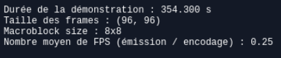
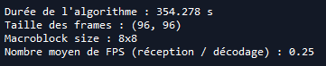
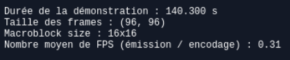
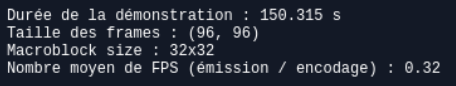
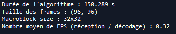

# Validation Fonctionnelle

## Type de test 

Test d'intégration

## Fonctionnalité testée

Langage : PYTHON

Matériel : PC / RASPBERRY PI

Étape de code testée : L'ensemble du prototype Python (adapté dans les 2 programmes *main_RPi_emettrice.py* et *main_PC_recepteur.py*)

## Manipulation 

L'objectif de ce test d'intégration est de tester notre prototype Python dans le cadre d'une **démonstration physique**. Nous utiliserons ici une Raspberry Pi (ou "RPi") avec une PiCaméra en tant qu'émetteur de données, et un PC portable en tant que récepteur.

Concrètement, voici ce qu'il se passe :

- la PiCaméra génère les frames (ici de taille 96x96)
- les frames sont extraites du stream continu de la PiCaméra, sous la forme d'arrays Numpy tridimensionnels (exceptionnellement au format **BGR** - et non RGB - car on utilise la bibliothèque OpenCV pour décoder le stream en array exploitable)
- les arrays précédents sont encodés (ie convertis en bitstream)
- ce même bitstream (pour chaque frame) est envoyé dans le réseau (protocole SSH pour communiquer correctement - et surtout de manière sécurisée - entre la RPi et le récepteur) vers le récepteur (donc le PC)
- le PC reçoit les bitstreams associés à chaque frame **en temps réel**, puis les décode **en temps réel** (sous la forme d'arrays Numpy tridimensionnels au format **RGB**)
- les images décodées sont ensuite affichées sur l'écran du PC/récepteur via la fonction matplotlib.pyplot.show (ce qui explique notamment pourquoi on avait besoin d'avoir les images décodées au format RGB)

Pour pouvoir tester cet algorithme par vous-même avec le code fourni, il faut respecter quelques étapes.

D'abord, pour tester si la communication entre l'émetteur (Raspberry Pi avec une PiCamera) et le récepteur (PC ou RPi) fonctionne, d'abord lancer *test_recepteur.py* sur le récepteur puis *test_emetteur.py* sur l'émetteur (en changeant bien évidemment les adresses IP définies dans ces 2 scripts).

**NB** : Il faut bien veiller à link la RPi au récepteur avec un câble Éthernet si on veut avoir une chance de détecter le récepteur depuis la RPi (et l'émetteur depuis le PC récepteur). Idéalement, il faudrait également que l'émetteur et le récepteur soient tous les deux connectés sur le même réseau.

Puis, pour la démonstration, lancer *main_PC_recepteur.py* sur le récepteur (PC ou RPi) et *main_RPi_emettrice.py* sur la RPi. Ne pas oublier d'également changer les adresses IP définies dans ces 2 derniers scripts.

Une fois la démo lancée, sur l'écran link à la RPi, il suffit d'appuyer sur la touche "q" du clavier afin
d'arrêter le flux vidéo de la PiCamera (et donc par la même occasion les 2 programmes en cours).

## Résultats

Nous avons ici décidé de travailler avec des frames de taille 96x96 pixels (générées par la PiCamera), afin de ne pas surcharger le programme Python (qui, rappelons-le, n'a pas des performances temporelles remarquables).

**==> Tout d'abord, la démonstration fonctionne parfaitement ! Bien que le framerate soit faible (car on travaille avec le prototype Python), les images générées en entrée et les images décodées en sortie sont *synchronisées* !**

Comme le taux de compression pour chaque frame est difficilement obtenable (bien que ce soit possible), et qu'il n'est (**dans ce cas précis**) pas nécessairement très intéressant, nous avons choisi de nous concentrer sur l'extraction du nombre moyen de **FPS** (Frames Per Second) seulement. En effet, le taux de compression moyen est ici "inintéressant" pour 2 raisons majeures :

- il ne varie pas du taux de compression d'une image de taille 96x96, car on a ici simplement appliqué l'algorithme de compression d'une image à chacune des frames, ce qui n'est **pas** ce qu'un algorithme de compression vidéo idéal effectue dans la réalité (lien entre les frames, détection de mouvement, etc)
- le taux de compression d'une image de taille 96x96 est déjà connu (ou en tout cas facilement obtenable via nos différents programmes principaux)

Pour différentes tailles de macroblocs (respectivement 8x8, 16x16 et 32x32), on obtient alors les résultats suivants :

Pour des macroblocs 8x8 (**pour une même démonstration**) :

Pour des macroblocs 16x16 (**pour une même démonstration**) :

Pour des macroblocs 32x32 (**pour une même démonstration**) :

On retrouve notamment le fait qu'à partir de `macroblock_size = 16`, les différences de performances (pour des images **réelles**, et non générées aléatoirement) ne varient que très peu.

**NB** : Le récepteur peut également être une RPi (et non un PC).

Tout les résultats exposés dans ce document peuvent bien évidemment être (et **seront**) répliqués le jour de la soutenance !