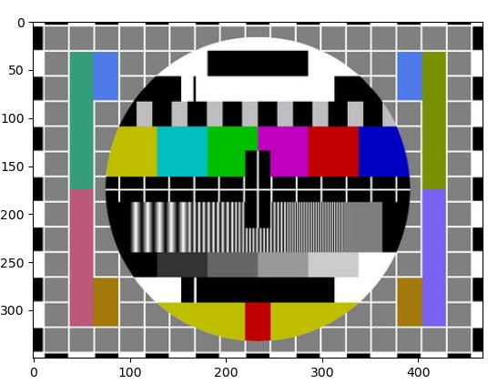
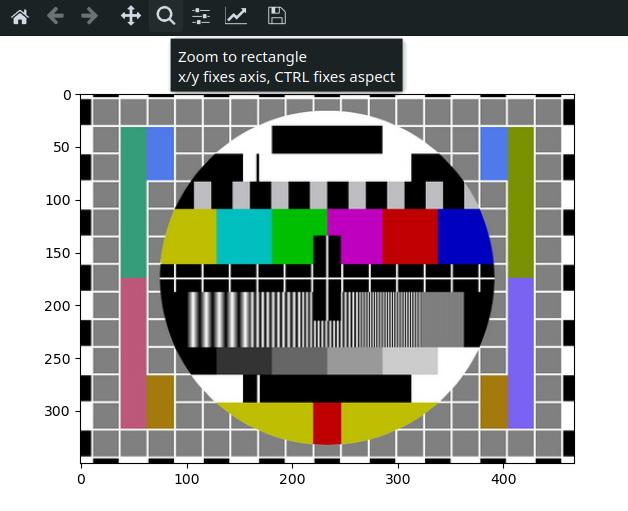
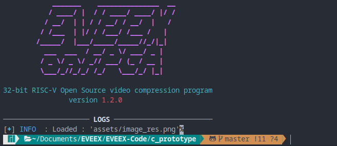
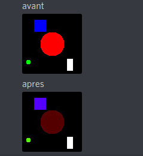

# Validation Fonctionnelle

> Validation Fonctionnelle Usine n° **2.1**
>
> Type de test : **Fonctionnel**

## Fonctionnalité testée

* Langage de programmation : C et Python et Golang

* Matériel utilisé : Ordinateur personnel à architecture x86_64 / RaspberryPi à architecture ARM / SiSpeed Maixduino à architecture RISC-V / FPGA à architecture variable 

* Étape de code à tester : 
  * conversion des données d'une images à partir d'un format existant (.png, .jpeg) vers un type de données exploitables par un algorithme
  * conversion à partir d'un format d'image courant (RGB) à un format moins entropique (YUV). 

## Manipulation effectuée

#### Python 


Test de la fonction `RGBtoYUV` sur un nuancier de couleur et vérification visuelle du respect de la colorimétrie. 

>  *les coefficients étant identiques pour les 3 langages, une vérification dans un seul langage suffit*

#### C


Test des fonctions `loadIMG`, `toYUVImage` sur une image de test : nuancier ou image généré via le fichier de génération d'images tests sur python

#### Golang


Test de la fonction `toYUVImage` et tests unitaires sur les fonctions du type `Image` sur des images générés, notamment test de la fonction `LoadImageFromFile` afin d'obtenir un objet exploitable par les algorithmes

#### Images de test 


<center><b>Fig 1 : </b> Image de test issue de l'algorithme de génération d'images en python</center>


<center><b>Fig 2 : </b> Nuancier de couleurs classique disponible sur internet</center>


## Résultats 

#### Python

Prenons l'image de la **Fig 2** et testons sa conversion au format YUV par l'algorithme en python pour vérifier le respect de la colorimétrie.

Voici un extrait de cette image à peu près au milieu pour la version RGB :

```bash
RGB sample :  
[[[255 255 255]
  [254 254 254]
  [255 255 255]
  ...
  [255 255 255]
  [255 255 255]
  [253 253 253]]

 [[253 253 253]
  [192 192 192]
  [ 87  87  87]
  ...
  [ 93  93  93]
  [ 90  90  90]
  [ 90  90  90]]
```

De même pour la version YUV

```bash
YUV sample :
[[[2.55e+02 2.55e-03 2.55e-03]
  [2.54e+02 2.54e-03 2.54e-03]
  [2.55e+02 2.55e-03 2.55e-03]
  ...
  [2.55e+02 2.55e-03 2.55e-03]
  [2.55e+02 2.55e-03 2.55e-03]
  [2.53e+02 2.53e-03 2.53e-03]]

 [[2.53e+02 2.53e-03 2.53e-03]
  [1.92e+02 1.92e-03 1.92e-03]
  [8.70e+01 8.70e-04 8.70e-04]
  ...
  [9.30e+01 9.30e-04 9.30e-04]
  [9.00e+01 9.00e-04 9.00e-04]
  [9.00e+01 9.00e-04 9.00e-04]]
```

On a un bon premier retour. L'avantage d'utiliser le format YUV par rapport au RGB est le fait que la quasi-totalité des données se trouvent sur la partie "Y" du pixel, la partie "U" et "V" n'étant que des informations de chrominance ces dernières sont effectivement proche de zéro.

D'un point de vue visuel on obtient l'image suivante pour les données RGB : 



<center><b>Fig 3 : </b> Résultat de l'exploitation de l'image au format RGB</center>



<center><b>Fig 4 : </b> Résultat de l'exploitation de l'image au format YUV</center>

Visuellement les résultats sont identiques ce qui est normal cette étape n'étant pas destructrice en termes d'information. 

#### C

Pour charger une image avec la version du code en C on passe par une bibliothèque externe "stb_image" pour éviter d'avoir à réinventer la roue et réécrire 7000 lignes de codes.

Le résultat de ce chargement est signalé par une ligne dans la console :



<center><b>Fig 5 : </b> Retour sur le chargement de l'image</center>

De même la conversion en YUV donne des résultats similaires quoi que légèrement détériores lors de la sauvegarde. Après investigation il semblerait que cela soit un problème récurrent avec cette bibliothèque de fonctions.



<center><b>Fig 6 : </b> Différence entre les versions RGB et YUV en C</center>

#### Golang

La gestion des images est bien plus aisée en Golang. La plupart des fonctions nécessaires sont déjà présentes dans la bibliothèque standard.