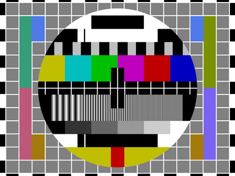

# Validation Fonctionnelle

## Type de test 

Fonctionnel 

## fonctionnalité testée

langage : C / PYTHON / GOLANG

matériel : PC / RASPBERRYPI / MAIXDUINO / FPGA 

étape de code testé : conversion d'un format existant vers un type exploitable pour l'algorithme ainsi qu'un format d'image idéal (YUV). 

## manip 

Python : test de le fonction `RGBtoYUV` sur un nuancier de couleur et vérification visuelle du respect de la colorimétrie. (*les coefficients sont identiques pour les 3 langages donc une vérification en python suffit*)

C : test des fonctions `loadIMG, toYUVImage` sur une image test (nuancier ou image généré via le fichier de génération d'images tests sur python )

Golang : test de la fonction `toYUVImage` et tests unitaires sur les fonctions du type `Image` sur des images générés (les mêmes que précédemment), notamment la fonction `LoadImageFromFile` 

images test : 

## Résultats 

