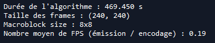
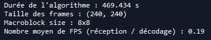
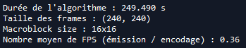
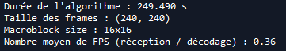
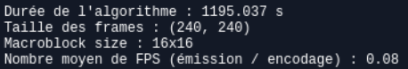
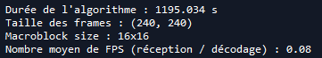

# Validation Fonctionnelle

## Type de test 

Test fonctionnel (+ éventuellement test d'intégration)

## Fonctionnalité testée

langage : PYTHON

matériel : PC (+ éventuellement RASPBERRY PI)

étape de code testée : L'ensemble du prototype Python (adapté dans les 2 programmes *main_emetteur_video.py* et *main_recepteur_video.py*)

## Manipulation 

L'objectif de cette manipulation est le même que celui de *VFU_Démo_RPi*, mais avec une vidéo **pré-enregistrée**, et non avec un flux vidéo récupéré en temps réel : on veut transférer des données vidéo (du coup **pré-enregistrées**) d'un émetteur à un récepteur.

- **Cas 1** : émetteur = PC, et récepteur = ce même PC (i.e. on fait un envoi dans le réseau **local**)

Sur un terminal (resp. une console), d'abord lancer *main_recepteur_video.py*. Puis, sur un autre terminal (resp. une autre console), lancer *main_emetteur_video.py*.

- **Cas 2** : émetteur = RPi et récepteur = PC

Idem *VFU_Démo_RPi* (partie "Manipulation"), mais considérer les programmes *main_emetteur_video.py* et *main_recepteur_video.py* au lieu de *main_RPi_emettrice.py* et *main_PC_recepteur*.

## Résultats 

Ce test s'est effectué avec une vidéo simple de 3 secondes, et contenant 90 frames de taille 240x240 pixels. De même que pour *VFU_Démo_RPi*, le taux de compression moyen est ici "inintéressant", donc on s'intéressera surtout au nombre moyen de frames encodées/décodées par seconde (qu'on appellera ici "FPS" par abus de langage).

**==> Tout d'abord, ce test est opérationnel, bien que le transfert de données ne se fasse pas avec des performances temporelles *idéales* !**

- **Cas 1** : émetteur = PC, et récepteur = ce même PC (i.e. on fait un envoi dans le réseau **local**)

Pour différentes tailles de macroblocs (respectivement 8x8 et 16x16), on obtient les résultats suivants :

Pour des macroblocs 8x8 (**pour une même démonstration**) :

Pour des macroblocs 16x16 (**pour une même démonstration**) :

On retrouve notamment que plus la taille de `macroblock_size` augmente, meilleures sont les performances de l'algorithme.

- **Cas 2** : émetteur = RPi et récepteur = PC

On obtient, pour des macroblocs 16x16 (**pour une même démonstration**) :

Ce dernier résultat (cas 2) est **étonnant** : en effet, il impliquerait que la qualité du réseau a une influence *significative* sur les performances de notre algorithme, ce qui n'a (avant cette manipulation) jamais été observé. Que doit-on en conclure ?