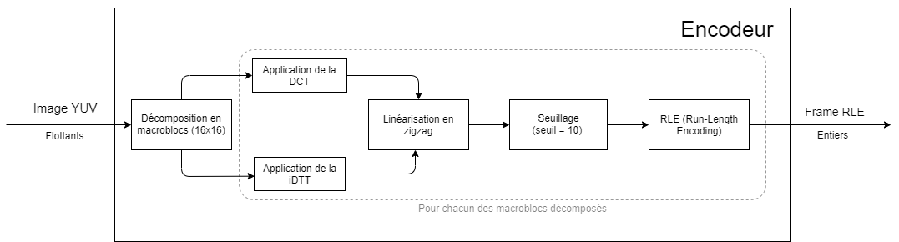
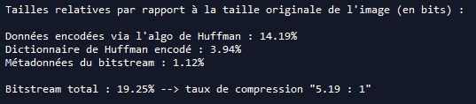
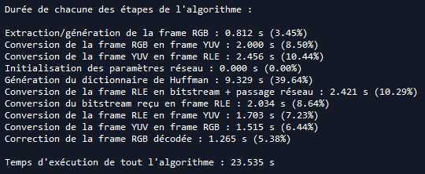
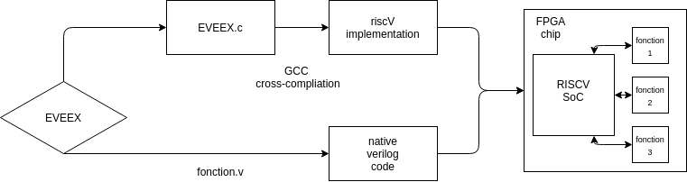

# Rapport d'avancement : projet Encodage Vidéo ENSTA Bretagne Expérimental (EVEEX)

Membres du groupe : Guillaume Leinen, Jean-Noël Clink, Hussein Saad, Alexandre Froehlich, Hugo Questroy

Encadrants : Pascal Cotret, Jean-Christophe Le Lann, Joël Champeau

Code disponible sur GitHub ==> https://github.com/EVEEX-Project

Eportfolio Mahara disponible => https://mahara.ensta-bretagne.fr/view/groupviews.php?group=348

## Abstract

Most of the world's bandwidth is nowadays used for the exchange of multimedia content, especially video streaming. With more than 2 billion users every month on Youtube alone [1], video streaming has not only become a taken-for-granted technology, but one that consumes a lot of resources both in terms of energy and storage.

To reduce these excessive consumptions, a solution is video compression. While business consortia compete for royalties on their proprietary compression algorithms such as MPEG-1 or x264, we want to offer a viable and open source alternative.

During this school year, we are going to design an algorithm to compress a raw video stream to send it over a network or simply to store it in a file, and then a second algorithm to decompress this data. Once the algorithm is operational and mature, we will carry out a purely hardware implementation in order to optimise the computing time and energy consumption related to data compression.

We will use several programming languages to build different prototypes incrementally. We are going to start with Python to create a naive algorithm that everyone can understand, then we are going to translate it into C to optimise its execution and above all to start getting closer to a hardware implementation. Finally we will translate this last code using LiTex to create the hardware implementation on FPGA. 

It is obvious that to carry out these steps we cannot rely on existing software libraries for reasons of code portability to different languages and then to different platforms.

The objective at the end of this school year is to obtain a marketable product for video stream compression and transmission over the network using a webcam and two FPGA cards, all of course open source and available on GitHub.

## Résumé

La majeure partie de la bande passante mondiale est aujourd'hui utilisée pour l'échange de contenu multimédia, en particulier le streaming vidéo. Avec plus de 2 milliards d'utilisateurs chaque mois sur YouTube seulement  [1], le streaming vidéo est devenu une technologie considérée comme prise pour acquise, mais qui consomme beaucoup de ressources tant en termes d'énergie que de stockage.

Pour réduire ces consommations excessives, une solution est la compression vidéo. Alors que les consortiums d'entreprises se font concurrence pour les redevances sur leurs algorithmes de compression propriétaires tels que MPEG-1 ou x264, nous voulons offrir une alternative viable et open source.

Au cours de cette année scolaire, nous allons concevoir un algorithme pour compresser un flux vidéo brut afin de l'envoyer sur un réseau ou simplement de le stocker dans un fichier, puis un second algorithme pour décompresser ces données. Une fois que l'algorithme sera opérationnel et mature, nous procéderons à une implémentation purement matérielle afin d'optimiser le temps de calcul et la consommation d'énergie liés à la compression des données.

Nous utiliserons plusieurs langages de programmation pour construire différents prototypes de façon incrémentale. Nous allons commencer par Python pour créer un algorithme naïf que tout le monde peut comprendre, puis nous allons le traduire en C pour optimiser son exécution et surtout pour commencer à nous rapprocher d'une implémentation matérielle. Enfin, nous allons traduire ce dernier code en utilisant LiteX pour créer l'implémentation matérielle sur FPGA. 

Il est évident que pour réaliser ces étapes, nous ne pouvons pas nous appuyer sur les bibliothèques logicielles existantes pour des raisons de portabilité du code vers différents langages puis vers différentes plateformes.

L'objectif à la fin de cette année scolaire est d'obtenir un produit commercialisable pour la compression et la transmission de flux vidéo sur le réseau en utilisant une webcam et deux cartes FPGA, toutes bien sûr open source et disponibles sur GitHub.

<div style="page-break-after: always; break-after: page;"></div>

## Table des matières
[TOC]

## Remerciements 

- Nos encadrants Pascal Cotret, Jean-Christophe Le Lann et Joël Champeau, qui nous aident à définir les objectifs à atteindre, nous prêtent le matériel nécessaire en particulier les cartes FPGA, ainsi qu'a résoudre des problèmes théoriques. 

- Enjoy Digital, société créée par un Alumni Ensta-Bretagne, et son produit Litex qui nous sera très utile sur l'implémentation hardware. 

- Le site FPGA4students pour ses tutoriels VHDL/Verilog.

- Jean-Christophe Leinen pour ses conseils sur les méthodes Agiles.

- Aliexpress pour les caméras pas chères.

  

<div style="page-break-after: always; break-after: page;"></div>

## Introduction

​	Aujourd'hui, le contenu vidéo, en particulier le *streaming* , représente 61% de la bande passante mondiale [1]. Cependant, si les derniers algorithmes présentent des performances très convaincantes, force est de constater que les codecs anciens comme le MPEG-4 (mp4) sont encore très largement utilisés. Il n'existe pas aujourd'hui de codec *open-source* doté de performances en accord avec les besoins d’aujourd’hui, que ce soit au niveau de la qualité d'image ou de la bande passante nécessaire. Car en effet, et cela est peu connu, les codecs largement utilisés comme le H.265 ou le MP4 sont en source fermée (closed-source), et demande des royalties pour une utilisation commerciale par une entreprise. 


<center> <i>Figure 1 : Carte des tarifs pour utiliser HVEC (h.265). Cela peut représenter un coût conséquent pour les entreprises</i></center>

​	Parallèlement à ça, il existe depuis plusieurs années une technologie de circuits imprimés appelé Field Programmable Gate Array (ou **FPGA**). Une puce FPGA est un circuit imprimé **reconfigurable** fonctionnant à base de portes logiques (par opposition au processeur qui ne peut être reprogrammé). Cette technologie a pris son envol à partir des années 90, mais c'est aujourd'hui que les entreprises, et plus particulièrement les géants du silicium (Intel, AMD) s’intéressent de près à cette technologie. En effet, les puces FPGA disposent de plusieurs avantages qui en font une **technologie de rupture** dans certains domaines d'applications : 

- Le caractère reconfigurable permet un prototypage de circuit intégré final, tout en ne passant pas par une couche d'émulation logicielle coûteuse et peu performante. 
- Son architecture en portes logiques permet un **grand parallélisme** dans les calculs, ce qui permet d’accélérer considérablement certaines tâches parallélisables (compression/décompression de fichiers, calculs 3D, deep learning, réseaux de neurones, etc). 
- Son implémentation "hardware" d'un algorithme (a contrario de l'utilisation d'un jeu d'instructions pour les processeurs) permet une optimisation poussée du produit, que ce soit en termes de performances ou de consommation électrique, cette dernière représentant un enjeu important de l’électronique moderne. 

**En examinant ces avantages, on comprend vite l’intérêt d'une telle technologie dans la compression et le traitement vidéo. **

​	Afin de répondre à cette problématique nouvelle, l'ENSTA Bretagne voudrait développer un algorithme de compression vidéo, qui soit **open-source** et doté de performances convaincantes (définies par la suite), puis implémenter cet algorithme sur une carte FPGA. La réalisation et l'implémentation de cet algorithme constitue notre travail, et se nomme **EVEEX (projet Encodage Vidéo ENSTA Bretagne Expérimental)**.

​	Dans ce rapport, nous allons définir les exigences de fonctionnement d'un tel système, puis présenter notre travail actuel (et futur), que ce soit au niveau de l'algorithme, ou de son implémentation sur une carte FPGA. 

<div style="page-break-after: always; break-after: page;"></div>

## Stade d'avancement du projet 

### Définition des exigences  

Afin de définir clairement nos objectifs pour ce projet, il est primordial de définir les exigences, qu'elles soient fonctionnelles ou physiques (programmation).

Nous l'avons abordée dans l'introduction, la problématique des codecs vidéos est **primordiale** dans la gestion de la bande passante globale et de l'impact énergétique d'Internet. Pour permettre une amélioration collaborative et un accès universel, il est donc primordial que le projet soit **open-source**. Cet algorithme doit permettre l'extraction d'un flux vidéo, provenant par exemple d'une caméra, la compression de celui-ci, le formatage des données compressées, l'envoi de ces données à travers le réseau, le décodage des données reçues via le réseau, la décompression des données compressées ainsi que l'affichage de celles-ci.

**Enfin, l'algorithme doit être développé dans un langage permettant une implémentation sur FPGA.** Nous verrons plus tard que le choix du language est un point crucial dans la réalisation du projet. 

Nous avons donc défini un certain nombre d'exigences avec les performances attendues lorsqu'elles sont pertinentes, ainsi que notre certitude quand à la réalisation de ces exigences.  

Les points de vocabulaire au niveau de exigences seront définis par la suite dans le rapport, dans un glossaire. 


| Numéro identifiant l'exigence |                           Exigence                           |                    Performances attendues                    |  Certitude quant à la réalisation de cette exigence (en %)   |
| :---------------------------: | :----------------------------------------------------------: | :----------------------------------------------------------: | :----------------------------------------------------------: |
|               1               | Le projet doit être intégralement open-source et accessible gratuitement (exigence non fonctionnelle) |                             None                             | 100% => après analyse, il est probable que l'intégralité des solutions à incorporer soit open-source. En revanche, la chaîne de compilation sur FPGA dépend du fabricant de la carte choisie par un utilisateur. Si ces logiciels (Intel Quartus, Xilinx Vivado) sont gratuits, il ne sont en revanche pas open-source. Malgré tout il existe des solutions FPGA (carte + IDE) open-source comme Lattice. |
|              2.1              | L'algorithme doit pouvoir recevoir un flux photos et vidéo "brut" et le convertir en un format exploitable |          Conversion d'un flux RGB en flux YUV/YCbCr          | 100%, la conversion étant un simple calcul matriciel, il est facile à implémenter dans un language haut-niveau (Python), et possiblement implémentable de façon directe en HDL sur la carte FPGA. |
|             2.2.1             |       L'algorithme doit compresser des données brutes        | Dans un premier temps, performances analogues au MPEG-1 => 20:1 pour une photo, 100:1 pour vidéo | 50%, si le taux de compression image semble atteignable (à l'heure actuelle environ 10:1 sur Python), le taux de compression vidéo va demander pas mal d'optimisations du code en langage C. |
|             2.2.2             |    L'algorithme doit décompresser des données compressées    | Performances identiques ou supérieures à celles de l'encodage | 100%, le décodage d'un arbre du Huffman est plus rapide que l'encodage. |
|             2.2.3             | L'algorithme doit compresser les données d'une manière originale (pas une copie de MPEG) |                             None                             | 80%, nous pensons incorporer une taille variable de macroblocs de traitement, ce qui nous différencie fondamentalement du MPEG |
|             2.3.1             | L'algorithme doit pouvoir formater les données compressées afin qu'elles puissent être envoyées via un réseau. |                             None                             | 100%, nous avons une bonne maîtrise du bitstream sur Python et l'implémentation en langage C est en cours. |
|             2.3.2             | L'algorithme doit pouvoir recevoir les données par le réseau et les comprendre |                             None                             |                 100%, pour les mêmes raisons                 |
|             2.4.1             | L'algorithme doit permettre un affichage d'une image décodée |               Affichage VGA sur la carte FPGA                |   100% si on utilise Litex, et déjà réalisé en VHDL natif    |
|              3.1              |   L'algorithme doit pouvoir s’exécuter sur une carte FPGA    |  Identiques ou supérieures à la version PC de l'algorithme   | 70%, avec l'utilisation d'un SOC RiscV l'implémentation C devrait être jouable. Le principal point bloquant est la gestion de la mémoire sur la carte FPGA. |
|              4.1              | L'algorithme implémenté sur FPGA doit induire une faible consommation électrique | Inférieures à la consommation d'un PC exécutant l'algorithme. (<30W) | 100%, les FPGA consomment nativement peu d'énergie (notre modèle s'alimente par port micro-USB) |

On rajoute à ces exigences les fonctions définissant les relations entre l'algorithme et les acteurs externes. Pour cela, la méthode du diagramme en pieuvre est utilisée. Elle permet d'illustrer clairement les fonctions accomplies par le système (ie l'algorithme EVEEX). 


<center> <i>Figure 2 : Diagramme en pieuvre du projet EVEEX</i></center>


- FP1 : Transmission d'images / vidéo entre 2 PC via un réseau
- FP2 : Transmission d'images / vidéo entre 2 FPGA via un réseau
- FC1 : Les données doivent être compressées *(pour être transmises par le réseau)*
- FC2 : Les 2 machines doivent être reliées via un réseau 	
- FC3 : Un FPGA doit pouvoir comprendre l'algorithme
- FC4 : L'algorithme doit être différent des algorithmes existants (pour des raisons de copyright) 
- FC5 : L'algorithme doit être open-source 
- FC6 : L'algorithme doit permettre une réduction de la consommation électrique (sur FPGA)

L'architecture physique étant plus spécialisée et technique, nous l'aborderons au sein de la prochaine partie, consacrée au fonctionnement interne de l'algorithme et de son architecture de code. 

### Réalisation de l'algorithme

La réalisation de l'algorithme constitue une part très importante du projet, puisque les performances d'EVEEX découlent directement des choix en termes de traitement. 

Pour cet algorithme de traitement des données, nous nous sommes basés sur le MJPEG, car il est relativement simple à appréhender. **L'objectif de notre algorithme est de compresser l'image de référence le plus possible (ie avoir le meilleur taux de compression), et de faire cela le plus rapidement et le plus efficacement possible.**

Le fonctionnement global de l'algorithme est détaillé dans le diagramme en blocs fourni en annexe. Il est composé de 3 phases principales. Pour chacune de ces 3 étapes (encodage, passage réseau et décodage), nous ferons un *zoom* sur le diagramme que nous avons effectué (par souci de simplicité).

L'image, au format RGB (que sort nativement la plupart des cameras), est tout d'abord **convertie au format chrominance/luminance (YUV)**. 

Ensuite, l'image est découpée en **macroblocs** de 16x16 pixels. En réalité, comme une image RGB contient 3 canaux de couleur, les macroblocs sont en fait de taille 16x16x3, mais, par abus de langage, et par souci de simplicité, nous dirons simplement qu'ils ont une taille de 16x16 (ou NxN dans le cas général). Cette taille de macroblocs n'est pas arbitraire. En effet, nous avons déterminé **empiriquement** que, pour notre prototype, **et pour des images pré-existantes en 480p (720x480 pixels) ou alors générées aléatoirement**, les macroblocs 16x16 étaient ceux qui produisaient les meilleurs taux de compression parmi les tailles standards de macroblocs, à savoir 8x8, 16x16 et 32x32 pixels. Cette décomposition en macroblocs permet de faciliter le traitement de l'image et de paralléliser les tâches. De plus, nous nous différencierons des autres algorithmes existants en rendant cette taille de macroblocs **variable** en fonction du contenu du macrobloc. Par exemple, si un macrobloc présente un taux de contraste élevé, on réduit sa taille, alors que si c'est un aplat de couleur, on l'augmente. Cela permettra (a priori) d'améliorer le taux de compression.

Après cette étape, on applique diverses transformations **à chacune de ces matrices-macroblocs YUV** afin de les compresser. Ces transformations font partie de **l'étape d'encodage**.

* Une Transformation en Cosinus Discrète, ou **DCT**, qui est une transformation linéaire et **réversible** qui va permettre de **concentrer** les données du macrobloc YUV dans la diagonale de l'image de sortie (la diagonale "nord-ouest / sud-est"). Ainsi, en-dehors de cette zone, les composantes de l'image (après application de la DCT)  seront relativement faibles en valeur absolue, ce qui sera **très pratique** lors des étapes suivantes.

* On effectue ensuite **une linéarisation en zigzag** du macrobloc DCT ainsi généré. Cela signifie simplement que l'on va découper les 3 canaux 16x16 du macrobloc DCT en 3 vecteurs-listes de longueur 16x16 = 256. **On passe donc d'un array à 2 dimensions à un array en une seule dimension.** Ce découpage va se faire selon les 2x16-1 = 31 diagonales "sud-ouest / nord-est" de chacun des 3 canaux du macrobloc DCT (cf. image ci-dessous). Ce découpage, en conjonction avec la DCT (cf. étape précédente) est ici **extrêmement commode**, puisque l'on se retrouve avec des listes qui, en leur "centre", ont des valeurs représentatives non-négligeables, et puis, partout ailleurs, ces valeurs seront moindres.

  
  
  <center> <i>Figure 3 : Exemple de linéarisation en zigzag pour un macrobloc 6x6 (pour un seul canal de couleur)</i></center>

* On effectue maintenant l'étape de seuillage, aussi appelée **quantization**. Cette opération consiste à ramener à zéro tous les éléments des 3 listes (issues de la linéarisation en zigzag) qui sont inférieurs **(en valeur absolue)** à un certain seuil, appelé *threshold* (ou *DEFAULT_QUANTIZATION_THREASHOLD* dans le code). Comme énoncé précédemment, la plupart des valeurs de ces 3 listes seront relativement faibles, donc appliquer ce seuillage va nous permettre d'avoir en sortie 3 listes avec **beaucoup de zéros**. Le seuil a ici été déterminé empiriquement, à partir d'une série de tests sur des images-macroblocs générées aléatoirement. **On a choisi *threshold* = 10, car il s'agissait de la valeur maximale qui permet quand même d'avoir une bonne qualité d'image en sortie.** Il est important de noter que cette étape de seuillage est **irréversible**. 

* On passe ensuite à l'étape de la **RLE** (Run-Length Encoding). Cette étape consiste à regrouper de manière synthétique (dans des tuples, aussi appelés *tuples RLE*) les séries de zéros obtenues après l'étape de la quantization. Concrètement, si dans une liste seuillée on a 124 zéros puis un 5.21 (par exemple), d'abord 5.21 est arrondi à l'entier le plus proche (ici 5), puis cette série de 125 entiers sera stockée dans le tuple (124, 5). Plus généralement, si l'on a le tuple RLE "(U, V)", cela signifie que l'on a U zéros puis l'entier **non-nul** V. Ainsi, chaque macrobloc sera décrit de manière **extrêmement synthétique** par une liste de tuples RLE. **L'image finale, étant décomposée en une série de macroblocs, sera alors une liste de listes de tuples RLE.**




<center> <i>Figure 4 : Fonctionnement simplifié de l'encodeur</i></center>


La partie suivante concerne le formatage des données. On utilise pour cela un **arbre binaire de Huffman** qui permet à la fois de compresser et de formater les données selon une trame précise. On appellera la trame à transmettre un **bitstream**.


<center> <i> Figure 5 : Découpage d'un message en arbre binaire par fréquence d'apparition </i></center>

```
Encoded string : 10101001100110000110011011011011100100110101000010100010010111110101111100000101011001110101110000001001001101011111111010111010100111110011000101111101111010101100101110110011001001001101111000011111001000010
String decoded back : le chic de l'ensta bretagne sur la compression vide
```

L'arbre se base sur la récurrence des caractères afin de les ordonner et d'adresser à chaque caractère un mot binaire. Les "caractères" correspondent ici en fait à des tuples RLE. **L'idée est que, plus un tuple RLE apparaîtra souvent dans la frame RLE, moins le mot binaire qui lui est associé aura une taille élevée.** Les correspondances tuple RLE / mot binaire sont indiquées dans un dictionnaire, appelé **dictionnaire de Huffman**.

Après application de l'algorithme de Huffman **à la frame entière**, on se retrouve donc avec un dictionnaire de Huffman, ainsi qu'une frame RLE **prête à être encodée**. Le dictionnaire de Huffman est ensuite converti en bitstream (ici une chaîne de caractères de "0" et de "1"). 

La raison pour laquelle on considère un bitstream, **envoyé d'un client à un serveur**, est parce que l'on veut simuler le transfert de données compressées d'un ordinateur à un autre, qui correspondront idéalement d'ici la fin de l'année à un flux vidéo compressé.

**Comme rappelé en début de partie, l'objectif est d'avoir le meilleur taux de compression, c'est-à-dire que l'on veut minimiser la taille du bitstream total (envoyé du client au serveur) par rapport à la taille originale de l'image (en bits).**

L'envoi du bitstream total se fera en **4 étapes** :

1) On envoie l'en-tête de la frame (ou le **header**), qui va contenir les métadonnées générales de l'image considérée : l'identifiant de la frame (frame_id), le type de message (HEADER_MSG, ie 0), la largeur de l'image (img_width), la hauteur de l'image (img_height) et la taille des macroblocs (macroblock_size).

2) On envoie ensuite le dictionnaire de Huffman encodé, **paquet par paquet**. Chaque paquet, de taille inférieure ou égale à *bufsize* (ici 4096 octets), contiendra les métadonnées du paquet (frame_id, type_msg = DICT_MSG = 1, index et packet_size), ainsi que ses données utiles, à savoir la partie du dictionnaire encodé que l'on veut envoyer. Chacun de ces paquets forment ce qu'on a appelé dans le code la partie **dict** du bitstream.

3) On envoie ensuite les paquets associés à chacun des macroblocs, qui seront également de taille limitée (<= bufsize). De même, chacun des paquets envoyés contiendra les métadonnées du paquet (frame_id, type_msg = BODY_MSG = 2, macroblock_number, index et packet_size) ainsi que la partie du bitstream associé à un macrobloc RLE, **encodé entre-temps depuis la frame RLE via l'algorithme de Huffman** (fonction d'encodage). Chacun de ces paquets forment le *corps* du bitstream, aussi appelé **body** dans le code.

4) Enfin, on envoie le message de fin, aussi appelée la queue du message (ou **tail**), qui est simplement là pour signaler que l'on arrive à la toute fin du bitstream. Ce message de fin contient seulement frame_id et type_msg (HEADER_MSG, ie 3).

**Il est important de noter que, comme on veut également optimiser les performances temporelles de cet algorithme, il est primordial que l'on puisse convertir la frame RLE en bitstream ET envoyer ce dernier au serveur le plus rapidement possible.** Ainsi, nous avons jugé intéressant de générer le bitstream dans un buffer via un thread en parallèle. Le thread principal n'aura alors qu'à extraire les paquets à envoyer de ce buffer, sans avoir à perdre de temps à les convertir. De même, le thread "écrivain" n'aura pas à perdre de temps à attendre que le client envoie le paquet puis reçoive le message de retour du serveur (cf. diagramme).


<center> <i>Figure 6 : Fonctionnement simplifié de la partie réseau</i></center>


Maintenant que le serveur a reçu l'entièreté du bitstream associé à l'image compressée, on va pouvoir commencer l'étape de **décodage**, qui constitue la troisème et dernière étape de notre algorithme. **Il s'agit en fait de l'étape d'encodage, mais effectuée dans l'ordre inverse.** La seule étape qui ne réapparaît pas au décodage est la **quantization**, ce qui est logique puisqu'il s'agit d'une étape irréversible. En effet, si une valeur a été seuillée (ie ramenée à zéro), on n'a - à ce stade - aucun moyen de savoir quelle était sa valeur initiale avant le seuillage.


<center> <i>Figure 7 : Fonctionnement simplifié du décodeur</i></center>


Puis, finalement, après avoir décodé l'image au format YUV, on la convertit au format RGB.

En ce qui concerne les performances de cet algorithme, pour une image typique en 480p, notre algorithme s'effectue en une vingtaine de secondes en moyenne, et a des taux de compression variant entre 10:1 et 5:1 en moyenne. Ces taux de compression, *bien qu'améliorables*, sont toutefois assez satisfaisants, dans la mesure où les taux de compression d'algorithmes pré-existants (tels que le MPEG-2) varient typiquement entre 20:1 et 5:1 pour des images "classiques". Voici quelques statistiques de performances liées à notre algorithme :




<center> <i>Figure 8 : Exemple typique de statistiques concernant le taux de compression d'une image en 480p (DCT)</i></center>




<center> <i>Figure 9 : Exemple typique de statistiques concernant les temps d'exécution de chaque étape de notre algorithme, pour une image en 480p (DCT)</i></center>


**L'objectif est maintenant de traduire notre prototype Pyhton en C afin d'optimiser nos perfomances temporelles (et idéalement nos taux de compression).**


Nous avons également mis en place une alternative à la DCT, la **iDTT** (integer Discrete Tchebychev Transform). Cette transformation va considérer (en entrée ET en sortie) des tableaux d'entiers, et non de flottants, comme le fait la DCT. Par rapport à la DCT, cette transormation est un tout petit peu plus précise (ce qui se traduit concrètement par une qualité d'image un peu plus élevée), mais il s'avère que le temps de calcul est bien plus élevé que pour la DCT classique. Voici quelques statistiques de performances liées à la version alternative de notre algorithme qui utilise la iDTT :


.PNG)

<center> <i>Figure 10 : Exemple typique de statistiques concernant le taux de compression d'une image en 480p (iDTT)</i></center>


.PNG)

<center> <i>Figure 11 : Exemple typique de statistiques concernant les temps d'exécution de chaque étape de notre algorithme, pour une image en 480p (iDTT)</i></center>


Nous avons implémenté cette méthode supplémentaire afin de sortir un peu des sentiers battus et de voir ce que l'on pouvait faire (ou optimiser) avec des méthodes entières (et non flottantes comme avec la DCT). **Comme les performances temporelles de la DCT surpassent largement celles de la iDTT, nous continuerons évidemment à nous focaliser principalement sur la DCT.**


### Implémentation de l'algorithme sur FPGA

Au niveau du FPGA, les choses ont récemment évolué.

Nous étions partis pour développer l'algorithme entièrement en langage HDL, en passant pour les fonctions compliquées par un outil de *High Level Synthesis* (HLS). Cependant, nous nous sommes rendus compte qu'il serait compliqué de continuer ainsi, et cela pour de multiples raisons : 

* La HLS permet en théorie de transformer un code écrit en C en un code HDL comme le VHDL ou le Verilog. Le problème de la HLS est qu'elle induit de l’opacité dans le code machine final (on ne contrôle pas la génération de code). De plus, la syntaxe C nécessaire à son interprétation par le logiciel de HLS est extrêmement contraignante (impossible de faire des mallocs, typage limité aux types primaires, etc [5]). 
* Les langages HDL comme le VHDL sont extrêmement durs à appréhender, la courbe d'apprentissage est très abrupte (la syntaxe est très différente, c'est très bas niveau, les types sont limités à des mots binaires, etc). Il est donc assez déraisonnable d'apprendre la programmation machine en HDL en seulement quelques mois.
* L'interface de développement Xilinx Vivado, bien qu'elle permette quelques fonctionnalités intéressantes, notamment pour l'analyse de code et l'optimisation, est très lourde à installer (80 Go sur le disque dur) et est très difficile à prendre en main (environ 2 semaines pour comprendre le fonctionnement du framework et des principales fonctionnalités). On voudrait ainsi privilégier un IDE plus simple.
* Enfin, la gestion des I/O ainsi que de la RAM demande dans la grande majorité des cas de faire appel à des bibliothèques de Xilinx, qui sont gratuites pour certaines (et très chères pour d'autres), et qui sont surtout *closed-sourced*. 

Sur conseil de nos encadrants, nous nous sommes donc intéressés à une solution alternative proposée par Florent Kermarrec (ENSTA promotion 2008) et sa société "Enjoy Digital", spécialisée dans la fabrication de solutions FPGA sur mesure. Cette personne a développé un outil appeler **LiteX**. [6] 

```
                                      +---------------+
                                      |FPGA toolchains|
                                      +----^-----+----+
                                           |     |
                                        +--+-----v--+
                       +-------+        |           |
                       | Migen +-------->           |
                       +-------+        |           |        Your design
                                        |   LiteX   +---> ready to be used!
                                        |           |
              +----------------------+  |           |
              |LiteX Cores Ecosystem +-->           |
              +----------------------+  +-^-------^-+
               (Eth, SATA, DRAM, USB,     |       |
                PCIe, Video, etc...)      +       +
                                         board   target
                                         file    file
```

<center> <i>Figure 11 : Design flow de LiteX présent sur le GitHub de Enjoy Digital</i></center>

​	LiteX est un framework de développement FPGA basé sur le langage **Migen**, lui-même reprenant la syntaxe et le fonctionnement de Python. LiteX permet de développer des firmwares FPGA, aussi bien en bas niveau avec une syntaxe Python qu'en haut niveau via la création d'un SOC d'architecture RiscV, capable notamment d’accueillir un kernel Linux et d’exécuter du code C de manière normale (sans les inconvénients de la HLS). Il permet aussi de gérer nativement les principales entrées/sorties (Ethernet, VGA, USB) ainsi que la RAM, et ce par un code complètement open-source.

​	**Toutes ces caractéristiques le rendent idéal pour notre algorithme.** L’intérêt d'un tel système est aussi la possibilité de migrer certaines parties du code en VHDL afin de l’exécuter de la manière la plus optimisée possible. 

​	L'objectif pour nous est ainsi de compiler notre code C pour l'architecture RiscV (qui est open-source), de créer une architecture processeur "sur mesure" grâce à LiteX, et d'optimiser les points critiques de l'algorithme en les dévellopant directement en VHDL afin d'exploiter le parallélisme du FPGA. 

​	Concernant l'état du projet en lui-même, nous développons sur une carte Digilent Nexys4 DDR, donc nous utilisons la toolchain Vivado. Pour l'acquisition vidéo, nous avons opté pour des caméras OV7670. Elles filment en 480p et ont l'avantage d’être très peu chères (1.50€ l'unité), ce qui est pratique quand on débute dans le domaine (nous avons déja brûlé une camera). 

Nous avons adapté un code existant en VHDL afin d'afficher sur un écran en VGA le retour de la caméra 7670. La qualité d'image n'est pas la meilleure, mais elle devrait être suffisante pour exploiter l'algorithme.


<center> <i>Figure 12 : Rendu VGA de la caméra OV7670 reliée à un FPGA Nexys4 (il n'y a pas de compression, l'image est affichée de manière directe). La colorimétrie est liée à l'absence de blindage des câbles reliant la caméra à la carte</i></center>

Pour pallier le problème du branchement de la caméra (connecteur Pmod), notre encadrant Pascal Cotret nous a conçu un adaptateur maison. 


<center> <i> Figure 13 : Connecteurs P-mod conçus par M.Cotret </i></center>

Concernant le code en lui-même, nous commençons à comprendre la démarche de création d'un SOC,  notamment par la réalisation des tutoriels LiteX proposés par Enjoy Digital. 

### Déroulement Agile du projet 

Nous avons bien entendu respecté les principes de la méthode Agile pour la construction du projet. Premièrement, nous avons défini les rôles que chacun aurait à tenir au sein du projet : 

* Guillaume Leinen : ***Scrum Master***. C'est en quelque sorte le "maître du jeu". C'est lui qui va rythmer l'activité des sprints pour son Scrum (ici toute l'équipe du projet). Sur un projet impliquant un si faible nombre de personnes, il va bien entendu aussi participer au développement. Il est aussi le garant du respect de la méthode Agile. Enfin, le SM ne décide pas seul des tâches de chacun, mais veille plutôt à ce que chacun fasse ce qu'il souhaite faire pour faire avancer le projet dans son domaine de compétences.
* Alexandre Froehlich : ***Product Owner***. C'est l'équipier qui a la charge supplémentaire au sein du projet de vérifier que les activités du scrum sont utiles au projet final et correspondent au cahier des charges et aux exigences du projet. Traditionnellement, le PO se trouve chez le client pour de plus gros projets, en ce sens M. Le Lann a aussi joué une part du rôle en nous guidant sur les démarches à suivre concernant le développement, ou en nous fournissant des documentations techniques sur d'autres technologies de compression vidéo. 
* Hussein Saad, Jean-Noël Clink, Hugo Questroy :  ***Equipiers***. Ils se concentrent sur la réalisation du travail et le feedback quand celui-ci est terminé. Nous nous concentrons sur des retours à l'oral ou sous forme de courtes démonstrations vidéo, car la rédaction d'un rapport écrit est longue, rigide sur la forme et fastidieuse, **surtout dans un cadre agile où l'important est de réaliser la tache plutôt que de la documenter.** 

Les rôles ainsi distribués, nous avons choisi de séparer la force de travail en 2 parties distinctes, mais dont le travail peut être transverse : 

* Une partie "software" constituée d'Alexandre, Hugo et Jean-Noël. Leur travail consiste à se focaliser sur la construction de l'algorithme et son développement dans plusieurs langages. 
* Une partie "hardware" constituée de Guillaume et Hussein. Ils se focalisent sur l'implémentation matérielle de l'algorithme, et la gestion du FPGA et de ces constituants (RAM, I/O).

Néanmoins, avec l'introduction de LiteX (mélangeant code et matériel), cette séparation en 2 parties n'a plus vraiment de sens. Nous avons donc commencé à nous en défaire et à distribuer les tâches en fonction des appétences de chacun, qu'elles soient algorithmiques ou électroniques.

Concernant les sprints eux-mêmes, nous nous sommes orientés sur des sprints de **2 semaines**, avec un objectif de release (programme, documentation, fonctions supplémentaires, etc) **tous les 3 sprints**. Nous évaluons chaque tâche par un **système de points**, prenant en compte : la difficulté de la tâche, la longueur prévue, ou le nombre de personnes impliquées dans celle-ci. 

Un projet Agile implique un suivi organisé de ce qui a été fait. Pour cela, nous nous sommes orientés sur un outil simple qui s'intègre à Github : ***ZenHub*** [7] 


<center><i>Figure 14 : Page d'accueil du site ZenHub</i></center>

Zenhub est un outil de suivi de projet qui est assez semblable à une solution comme Trello, mais néanmoins différente sur certains points-clés : 

* Les tâches sont appelées *issues*, par analogie aux *issues* que l'on peut soumettre à un code existant sur GitHub. Cette similarité permet notamment de relier une tâche réalisée à un *push* de code sur GitHub. Nous n'avons pas pour l'instant utilisé cette fonctionnalité, et c'est quelque chose que souhaitons faire à l'avenir. En revanche, la suivante nous a été plus utile. 
* Le formalisme automatique permet à Zenhub **d'analyser les données** et d'en extraire différentes **statistiques et diagrammes**. Cela permet de surveiller facilement la répartition des taches et la dynamique de groupe, et ce de façon automatique. 

Voici quelques exemples des statistiques (et panneaux) de Zenhub. 


<center> <i> Figure 15 : Page principale </i></center>

Le premier panneau (ainsi que le principal) ressemble le plus à Trello. On sépare les issues en 2 catégories "à faire", sur le plus long terme dans le Icebox et à court terme dans le Backlog, puis une catégorie d'issues en cours "In progress". Une fois la tâche réalisée, elle part dans "Done" où l'on explique l'issue à tout le reste de l'équipe, et une fois cette étape faite, l'issue est "fermée". On peut trier les issues par différentes catégories, et les affecter à des "Milestones" (qui sont ici les sprints).


<center> <i> Figure 16 : Velocity tracking </i></center>

Une des statistiques les plus intéressantes est le "Velocity tracking". Il permet, via le systèmes de points de notation des issues, de voir facilement l’étendue du travail réalisé au sein d'un sprint. Les sprints terminés sont grisés. On constate une périodicité, due notamment à la release tous les 3 sprints. On rajoute des issues au fur et a mesure des idées de tout le monde (le sprint 7 est amené à grossir).


<center> <i> Figure 17 : Cumulative flow </i></center>

Le cumulative flow permet une vue différente du précédent graphique, avec notamment le découpage du workflow visible.


<center> <i> Figure 18 : Burndown report </i></center>

Le dernier diagramme utile est le "burndown report". Il permet d'observer la progression du travail au sein d'un sprint. Il n'est pas très exploitable dans notre cas car on travaille sur les créneaux de projet (donc toute les semaines). En revanche, pour une équipe qui travaille à plein temps sur le projet, cela pourrait s’avérer très utile.

### Points à venir 

En ce qui concerne l'algorithme de compression vidéo, plusieurs améliorations s'offrent à nous. La première, et certainement la plus importante, est de considérer le flux comme une vidéo et non pas comme une suite d'images (comme c'est le cas actuellement). En effet, pour l'instant nous implémentons la vidéo image après image, sans prendre en considération l'image qui précede ni celle qui suit. Ce n'est pas du tout optimal, puisque dans les vidéos il arrive souvent que, sur un même plan par exemple, des macroblocs de la vidéo changent très peu (voire pas du tout) d'une image à l'autre. On peut donc envoyer une seule fois ce macrobloc et le réutiliser après. 

Une autre amélioration serait d'avoir des macroblocs qui soient dynamiques : pour une zone avec très peu de nuances, on utiliserait des macroblocs plus grands, et pour une zone avec plus de détail, on considèrerait des macroblocs plus petits. Ces deux propositions amélioreraient le taux de compression, mais elles alourdiraient la complexité en temps. 


<center> <i>Figure 19 : Exemple d'un découpage en macroblocs dynamiques (à droite), comparé à un découpage en macroblocs de taille fixe (à gauche)</i></center>


Pour le deuxième semestre, nous allons adopter la solution d'utilisation du **LiteX** pour la création du SOC avec un architecture RiscV, avec l'avantage que c'est open-source, ce qui est le but de notre projet. Comme expliqué dans la diagramme, nous allons continuer de réaliser le code en c pour le compiler en utilisant l'architecture RiscV. Parallelement à ça, nous essayerons d'accelerer certaines fonctionnalités clés du programme par l'ajout de code écrit directement en Verilog. Certaines fonctions, comme le codage Huffman ou la RLE, existent déjà comme des IP propriétaires de Xilinx [8] et il devrait être possible avec la documentation fournie de copier le fonctionement de ces IP.



<center><i>Figure 20 : Framework de travail sur LiteX</i></center>

L'optimisation des fonctions critiques sera clé dans l'intérêt de l'implémentation FPGA. Sinon, cela revient juste à éxecuter du code C sur une autre architecture que le x64 (cela fonctionnerait comme ARM ou x86). Il serait intéressant, pour un potentiel autre projet, de prévoir la mise en place de cet algorithme sur smartphone afin de créer un facetime "made in ENSTA Bretagne".

<div style="page-break-after: always; break-after: page;"></div>
## Annexes

1. Diagramme en blocs complet de la version actuelle de l'algorithme EVEEX 

   


## Bibliographie

[1] Ines, S., 2020. *Youtube En Chiffres 2020*. [online] Agence des medias sociaux. Available at:  <https://www.agencedesmediassociaux.com/youtube-chiffres-2020/>  [Accessed 15 December 2020].

[2] Gaudiaut, T., 23 mars 2020. Le streaming vidéo représente 61 % du trafic Internet. [online] Statista. Available at: https://fr.statista.com/infographie/21207/repartition-du-trafic-internet-mondial-par-usage/ [Accessed 15 octobre 2020].

[3] Bouvet, R., 12 octobre 2020. AMD envisage d'acquerir xilinx, inventeur du FPGA, pour 30 milliards de dollars. [online] Tom's Hardware. Available at:  https://www.tomshardware.fr/amd-envisage-dacquerir-xilinx-inventeur-du-fpga-pour-30-milliards-de-dollars/ [Accessed 15 octobre 2020].

[4]Moore, A., 2017. *Fpgas For Dummies*. 2nd ed. [eBook] Intel Altera. Available at:  <https://www.intel.com/content/dam/www/programmable/us/en/pdfs/literature/misc/fpgas-for-dummies-ebook.pdf> [Accessed 31 September 2020].

[5]Chireux, N., 1999. Compression d'images fixes. p.5/24 [cours] Available at: https://www.chireux.fr/mp/cours/Compression%20JPEG.pdf [Accessed 31 September 2020]

[6] 2014. *Vivado Design Suite Tutorial : High-Level Synthesis*. [ebook] Available at:  <https://www.xilinx.com/support/documentation/sw_manuals/xilinx2014_2/ug871-vivado-high-level-synthesis-tutorial.pdf> [Accessed 15 October 2020].

[7] LiteX-hub - Collaborative FPGA projects around LiteX. Available at: https://github.com/litex-hub [Accessed 1 December 2020]. 

[8] Zenhub.com - project Management in Github. Available at: https://www.zenhub.com/ [Accessed 15 october 2020]

[9] Pilai, L., 2003. *Huffman Coding*. [pdf] Available at:  <https://www.xilinx.com/support/documentation/application_notes/xapp616.pdf> [Accessed 1 December 2020].

## Glossaire

**Flux-Vidéo:** Processus d'envoi, réception et lecture en continu de la vidéo.

**Open-Source:** Tout logiciel dont les codes sont ouverts gratuitement pour l'utilisation ou la duplication, et qui permet de favoriser le libre échange des savoirs informatiques.

**RGB:** Rouge, Vert, Bleu. C'est un système de codage informatique des couleurs. Chaque pixel possède une valeur de rouge, une de vert et une de bleu. 

**FPGA:** Une puce FPGA est un circuit imprimé reconfigurable fonctionnant à base de portes logiques.

**Macrobloc **(ou Macroblock) : Une partie de l'image de taille 16x16 pixels. 

**Bitstream:** Flux de données en binaire. 

**VHDL:** Langage de description de matériel destiné à représenter le comportement ainsi que l'architecture d'un système électronique numérique.

**IDE:** Environnement de Développement.

**Frames:** Images qui composent une vidéo. On parle de FPS (Frames Per Second) pour mesurer la fréquence d'affichage. 

**HLS**: High Level Synthesis. Outil logiciel permettant de synthétiser du code haut niveau en un code de plus bas niveau. 

**SoC**: System on Chip. Puce de sillicium intégrant plusieurs composants, comme de la mémoire, un processeur, et un composant de gestion d'entrées/sorties. 

