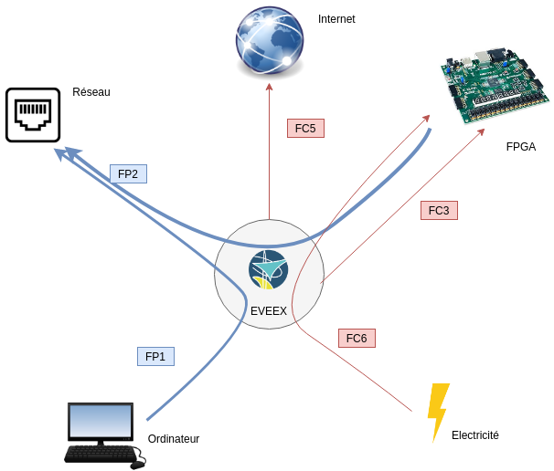
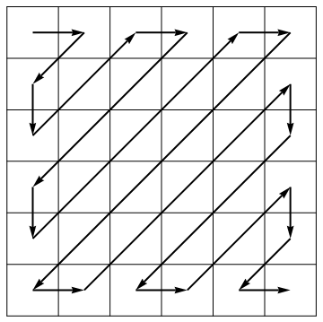
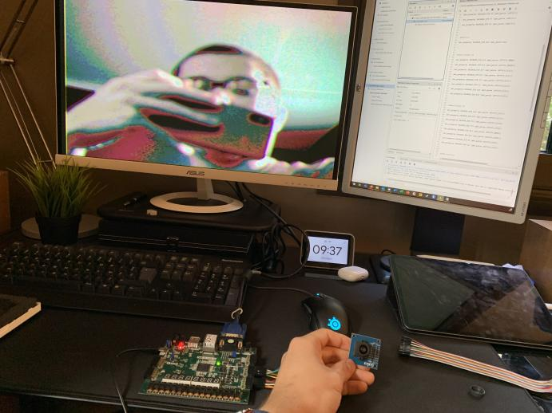
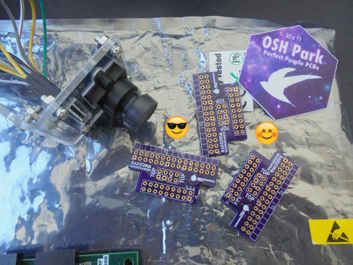
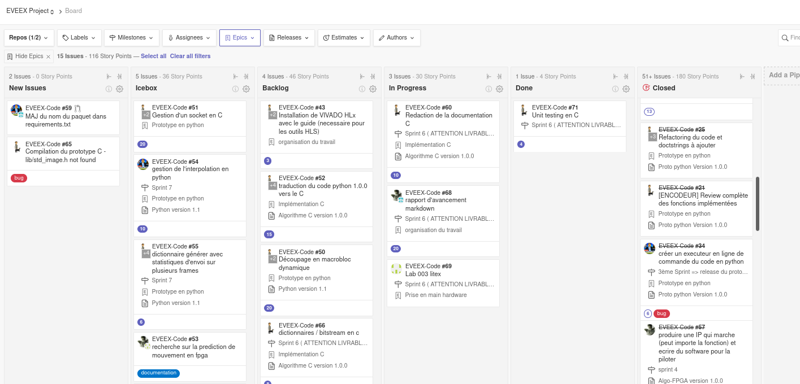
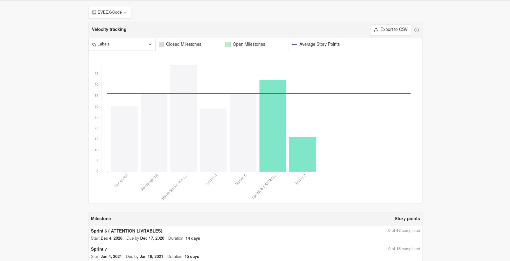
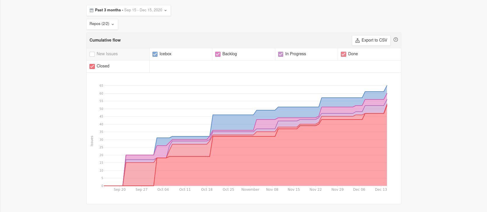
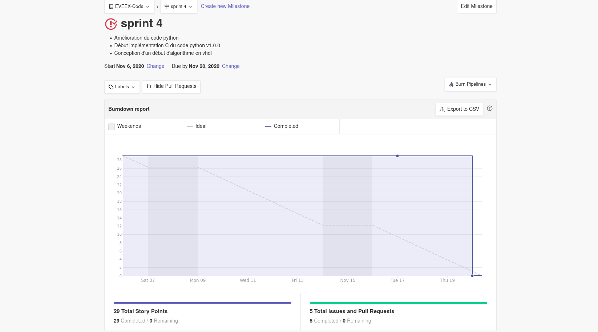
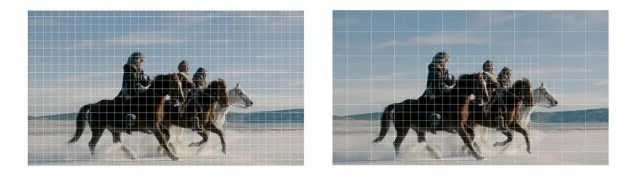
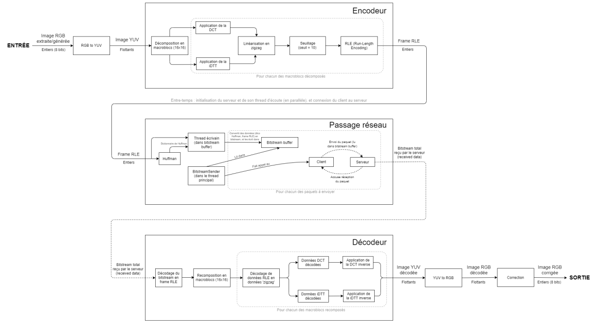

# Rapport d'avancement : projet Encodage Vidéo Ensta-Bretagne Expérimental (EVEEX)

Membres du groupe : Guillaume Leinen, Jean-Noël Clink, Hussein Saad, Alexandre Froehlich, Hugo Questroy

Encadrants : Pascal Cotret, Jean-Christophe Le Lann, Joël Champeau

## Abstract

Most of the world's bandwidth is nowadays used for the exchange of multimedia content, especially video streaming. With more than 2 billion users every month on Youtube alone [5 - abstract], video streaming has not only become a taken-for-granted technology, but one that consumes a lot of resources both in terms of energy and storage.

To reduce these excessive consumptions a solution is video compression. While business consortia compete for royalties on their proprietary compression algorithms such as MPEG-1 or x264, we want to offer a viable and open source alternative.

During this school year, we are going to design an algorithm to compress a raw video stream to send it over a network or simply to store it in a file, and then a second algorithm to decompress this data. Once the algorithm is operational and mature, we will carry out a purely hardware implementation in order to optimise the computing time and energy consumption related to data compression.

We will use several programming languages to build different prototypes incrementally. We are going to start with Python to create a naive algorithm that everyone can understand, then we are going to translate it into C to optimise its execution and above all to start getting closer to a hardware implementation. Finally we will translate this last code using LiTex to create the hardware implementation on FPGA. 

It is obvious that to carry out these steps we cannot rely on existing software libraries for reasons of code portability to different languages and then to different platforms.

The objective at the end of this school year is to obtain a marketable product for video stream compression and transmission over the network using a webcam and two FPGA cards, all of course open source and available on github.

## Résumé

La majeure partie de la bande passante mondiale est aujourd'hui utilisée pour l'échange de contenu multimédia, en particulier le streaming vidéo. Avec plus de 2 milliards d'utilisateurs chaque mois sur Youtube seulement  [5 - abstract], le streaming vidéo est devenu une technologie considérée comme prise pour acquise, mais qui consomme beaucoup de ressources tant en termes d'énergie que de stockage.

Pour réduire ces consommations excessives, une solution est la compression vidéo. Alors que les consortiums d'entreprises se font concurrence pour les redevances sur leurs algorithmes de compression propriétaires tels que MPEG-1 ou x264, nous voulons offrir une alternative viable et open source.

Au cours de cette année scolaire, nous allons concevoir un algorithme pour compresser un flux vidéo brut afin de l'envoyer sur un réseau ou simplement de le stocker dans un fichier, puis un second algorithme pour décompresser ces données. Une fois que l'algorithme sera opérationnel et mature, nous procéderons à une implémentation purement matérielle afin d'optimiser le temps de calcul et la consommation d'énergie liés à la compression des données.

Nous utiliserons plusieurs langages de programmation pour construire différents prototypes de façon incrémentale. Nous allons commencer par Python pour créer un algorithme naïf que tout le monde peut comprendre, puis nous allons le traduire en C pour optimiser son exécution et surtout pour commencer à nous rapprocher d'une implémentation matérielle. Enfin, nous allons traduire ce dernier code en utilisant LiteX pour créer l'implémentation matérielle sur FPGA. 

Il est évident que pour réaliser ces étapes, nous ne pouvons pas nous appuyer sur les bibliothèques logicielles existantes pour des raisons de portabilité du code vers différents langages puis vers différentes plates-formes.

L'objectif à la fin de cette année scolaire est d'obtenir un produit commercialisable pour la compression et la transmission de flux vidéo sur le réseau en utilisant une webcam et deux cartes FPGA, toutes bien sûr open source et disponibles sur github.

<div style="page-break-after: always; break-after: page;"></div>

## Table des matières
[TOC]

## Remerciements 

- Nos encadrants Pascal Cotret, Jean-Christophe Le Lann et Joël Champeau, qui nous aident à définir les objectifs à atteindre, ainsi qu'a résoudre des problèmes théoriques. 
- Enjoy Digital, société créé par un Alumni Ensta-Bretagne, et son produit Litex qui nous sera très utile sur l'implémentation hardware. 
- Le site FPGA4students pour ses tutoriels VHDL/Verilog.
- Jean-Christophe Leinen pour ces conseils sur les méthodes Agiles.

<div style="page-break-after: always; break-after: page;"></div>

## Introduction

​	Aujourd'hui, le contenu vidéo, en particulier le *streaming* , représente 61% de la bande passante mondiale [1]. Cependant si les derniers algorithmes présentes des performances très convaincantes, force est de constater que les codecs anciens comme le MPEG-4 (mp4) sont encore très largement utilisés. Il n'existe pas aujourd'hui de codec *open-source* doté de performances en accord avec les besoins d’aujourd’hui que ce soit au niveau de la qualité d'image ou de la bande-passante nécessaire. Car en effet, et cela est peu connu, les codecs largement utilisés comme le H.265 ou le MP4 sont en source fermée (closed-source), et demande des royalties pour une utilisation commerciale par une entreprise. 


<center> <i> Figure 1: Carte des tarifs pour utiliser HVEC (h.265). Cela peut représenter un coût conséquent pour les entreprises </i></center>

​	Parallèlement à ça, il existe depuis plusieurs d'années une technologie de circuits imprimés appelé Field programmable Gate Array (ou FPGA). Une puce FPGA est un circuit imprimé **reconfigurable** fonctionnant à base de portes logiques (par opposition au processeur qui ne peut être reprogrammé). Cette technologie prend son envol à partir des années 90, mais c'est aujourd'hui que les entreprises, et plus particulièrement les géants du silicium (intel, AMD) s’intéresse de près à cette technologie. En effet, elle dispose de plusieurs avantages qui en font une technologie de rupture dans certains domaines d'applications: 

- Le caractère reconfigurable permet un prototypage de circuit intégré final, tout en ne passant pas par une couche d'émulation logicielle coûteuse et peu performante. 
- Son architecture en portes logiques permet un grand parallélisme dans les calculs, ce qui permet d’accélérer considérablement certaines taches parallélisables (compression/décompression de fichier, calculs 3D, deep-learning, réseau de neurones, etc... ). 
- Son implémentation "hardware" d'un algorithme (à contrario de l'utilisation d'un jeu d'instruction pour les processeurs) permet une optimisation poussé du produit, que ce soit en terme de performance, ou de consommation électrique, le dernier représentant un enjeu important de l’électronique moderne. 

En examinant ces avantages, on comprend vite l’intérêt d'une tel technologie dans la compression et le traitement vidéo. 

​	Afin de répondre à cette problématique nouvelle, L'ENSTA Bretagne voudrait développer un algorithme de compression vidéo, qui soit open-source et doté de performances convaincantes (définies par la suite), et par la suite d'implémenter cette algorithme sur une carte FPGA. Ce projet d'algorithme constitue notre travail et se nomme EVEEX (projet Encodage Vidéo Ensta-Bretagne Expérimental). 

​	Dans ce rapport, nous allons définir les exigences de fonctionnement d'un tel système, puis présenter notre travail actuel (et futur), que ce soit au niveau de l'algorithme, ou de son implémentation sur une carte FPGA. 

<div style="page-break-after: always; break-after: page;"></div>

## Stade d'avancement du projet 

### Définition des exigences  

Afin de définir clairement nos objectifs pour ce projet, il est primordial de définir les exigences, qu'elles soient fonctionnelles ou physique (programmation). 

Nous l'avons aborder dans l'introduction, la problématique des codecs vidéos est primordiale dans la gestion de la bande passante globale ainsi que de l'impact énergétique d'Internet. Pour permettre une amélioration collaborative et un accès universelle, il est donc primordial que le projet soit open-source. Cet algorithme doit permettre l'ingestion d'un flux vidéo, provenant par exemple d'une camera, la compression de celui-ci, le formatage des données compressés, l'envoi de ces données à travers le réseau, le décodage des données reçu via le réseau, la décompression des données compressés ainsi que l'affichage de celles-ci. 

Enfin, l'algorithme doit être développer dans un langage permettant une implémentation sur fpga. Nous verrons plus tard que le choix du language est un point crucial dans la réalisation du projet. 

Nous avons donc défini un certain nombre d'exigences avec les performances attendus lorsqu'elle sont pertinentes, ainsi que notre certitude quand à la réalisation de ces exigences.  

Les points de vocabulaires au niveau de exigences seront définis par la suite dans le rapport et dans un glossaire. 


| Numéro identifiant l'exigence |                           exigence                           |                    performances attendus                     |  certitude quand à la réalisation de cette exigence (en %)   |
| :---------------------------: | :----------------------------------------------------------: | :----------------------------------------------------------: | :----------------------------------------------------------: |
|               1               | Le projet doit-être intégralement open-source et accessible gratuitement. (exigence non fonctionnelle) |                             None                             | 100% => après analyse, il est probable que l'intégralité des solutions à incorporer soit open-source. En revanche, la chaîne de compilation sur FPGA dépend du fabricant de la carte choisi par un utilisateur. Si ces logiciels (Intel Quartus, Xilinx Vivado) sont gratuits, il ne sont en revanche pas open-source. Malgré tout il existe des solutions FPGA (carte + IDE) open-sources comme Lattice. |
|              2.1              | L'algorithme doit pouvoir recevoir un flux photos et vidéo "brut" et le convertir en format exploitable |          Conversion d'un flux RGB en flux YUV/YCbCr          | 100%, la conversion étant un simple calcul matriciel, il est facile à implémenter dans un language haut-niveau (python), et possiblement implémentable de façon direct en HDL sur la carte FPGA. |
|             2.2.1             |        l'algorithme doit compresser les données brut         | Dans un premier temps, performances analogues au MPEG-1 => 20:1 pour une photo, 100:1 pour vidéo | 50%, si le taux de compression image semble atteignable (à l'heure actuelle environ 10:1 en python), le taux vidéo va demander pas mal d'optimisation du code en langage c. |
|             2.2.2             |    l'algorithme doit décompresser des données compressés     |            Identiques ou supérieurs à l'encodage             | 100%, le décodage d'un arbre du Huffmann est plus rapide que l'encodage. |
|             2.2.3             | l'algorithme doit compresser les données d'une manière originale (pas une copie de MPEG) |                             None                             | 80%, Nous pensons incorporer une taille variable de macrobloc de traitement, ce qui nous différencie fondamentalement du MPEG |
|             2.3.1             | l'algorithme doit pouvoir formater les données compresser afin qu'elle puissent être envoyé en réseau. |                             None                             | 100%, nous avons une bonne maîtrise du bitstream en python et l'implémentation c est en cours. |
|             2.3.2             | l'algorithme doit pouvoir recevoir les données par le réseau et les comprendre |                             None                             |                 100% pour les mêmes raisons                  |
|             2.4.1             | l'algorithme doit permettre un affichage d'une image décodé  |               affichage VGA sur la carte fpga                |   100% si on utilise Litex, et déjà réalisé en vhdl natif    |
|              3.1              |   l'algorithme doit pouvoir s’exécuter sur une carte FPGA    |   identiques ou supérieurs à la version pc de l'algorithme   | 70%, avec l'utilisation d'un SOC riscV l'implémentation C devrait être jouable. Le principal point bloquant est la gestion de la mémoire sur la carte FPGA. |
|              4.1              | l'algorithme implémenté sur fpga doit induire une faible consommation électrique | Inférieure à la consommation d'un PC exécutant l'algorithme. (<30W) | 100%, les fpga consomment nativement peu d'énergie (notre modèle s'alimente par port micro-usb) |

On rajoute à ces exigences les fonctions définissant les relations entre l'algorithme et les acteurs externes. Pour cela la méthode du diagramme en Pieuvre est utilisé. Elle permet d'illustrer clairement les fonctions accomplies par le système (algorithme EVEEX). 




<center> <i> Figure 2: diagramme "Pieuvre" du projet EVEEX</i></center>


- FP1: transmission d'images / vidéo entre 2 pc par réseau
- FP2: transmission d'images / vidéo entre 2 fpga par réseau
- FC1: les données doivent être compressés   (*Pour être transmises par le réseau*) 
- FC2: les 2 machines doivent être reliés en réseau 	
- FC3: Un FPGA doit pouvoir comprendre l'algorithme
- FC4: l'algorithme doit être différent des algorithmes existants (copyright) 
- FC5: l'algorithme doit être open-source 
- FC6: l'algorithme doit permettre une réduction de la consommation électrique (sur FPGA)

L'architecture physique étant plus spécialisé et technique, nous l'aborderons au sein de la prochaine partie, consacré au fonctionnement interne de l'algorithme et de son architecture de code. 

### Réalisation de l'algorithme

La réalisation de l'algorithme constitue une part très importante du projet, puisque les performances d'EVEEX découlent directement des choix en termes de traitement. 

Pour cet algorithme de traitement des données, nous nous sommes basés sur le MJPEG, car il est relativement simple à appréhender. **L'objectif de notre algorithme est de compresser l'image de référence le plus possible (ie avoir le meilleur taux de compression), et ce le plus rapidement et efficacement possible.**

Le fonctionnement de l'algorithme est détaillé dans le diagramme en bloc ci-dessous. Il est composé de plusieurs phases, dont certaines necessitant quelques concepts mathématiques.

L'image, au format RGB (que sort nativement la plupart des cameras), est tout d'abord convertie au format chrominance/luminance (YUV). 

Ensuite l'image est découpée en **macroblocs** de 16x16 pixels. En réalité, comme une image RGB contient 3 canaux de couleur, les macroblocs sont en fait de taille 16x16x3, mais, par abus de langage, et par souci de simplicité, nous dirons simplement qu'ils ont une taille de 16x16 (ou NxN dans le cas général). Cette taille de macroblocs n'est pas arbitraire. En effet, nous avons déterminé **empiriquement** que, pour notre prototype, **et pour des images pré-existantes en 480p (720 x 480 pixels) ou alors générées aléatoirement**, les macroblocs 16x16 étaient ceux qui produisaient les meilleurs taux de compression parmi les tailles standards de macroblocs, à savoir 8x8, 16x16 et 32x32 pixels. Cette décomposition en macroblocs permet de faciliter le traitement de l'image et de paralléliser les taches. Nous nous différencierons des autres algorithmes existants en rendant cette taille de macroblocs **variable** en fonction du contenu du macrobloc. Par exemple, si un macrobloc présente un taux de contraste élevé, on réduit sa taille, alors que si c'est un aplat de couleur, on l'augmente. Cela permettra (a priori) d'améliorer le taux de compression.

Après cette étape, on applique diverses transformations **à chacune de ces matrices-macroblocs** afin de les compresser : 

* Une Transformation en Cosinus Discrète, ou **DCT**, qui est une transformation linéaire et **réversible** qui va permettre de **concentrer** les données du macrobloc YUV dans la diagonale de l'image de sortie (la diagonale "nord-ouest / sud-est"). Ainsi, en-dehors de cette zone, les composantes de l'image (après application de la DCT)  seront relativement faibles en valeur absolue, ce qui sera très pratique lors des étapes suivantes.

* On effectue ensuite **une linéarisation en zigzag** du macrobloc DCT. Cela signifie simplement que l'on va découper les 3 canaux 16x16 du macrobloc DCT en 3 vecteurs-listes de longueur 16x16 = 256. Ce découpage va se faire selon les 2x16-1 = 31 diagonales "sud-ouest / nord-est" de chacun des 3 canaux du macrobloc DCT (cf. image ci-dessous). Ce découpage, en conjonction avec la DCT (cf. étape précédente) est ici **extrêmement commode**, puisque l'on se retrouve avec des listes qui, en leur "centre", ont des valeurs représentatives non-négligeables, et puis, partout ailleurs, elles seront moindres.

  
  
  <center> <i> Figure 3 : Exemple de linéarisation en zigzag pour un macrobloc 6x6 </i></center>

* On effectue maintenant l'étape de seuillage, aussi appelée **quantization**. Cette opération consiste à ramener à zéro tous les éléments des 3 listes issues de la linéarisation en zigzag qui sont inférieures **(en valeur absolue)** à un certain seuil, appelé *threshold*. Comme énoncé précédemment, la plupart des valeurs de ces 3 listes seront relativement faibles, donc appliquer ce seuillage va nous permettre d'avoir en sortie 3 listes avec **beaucoup de zéros**. Le seuil est ici déterminé empiriquement, à partir de tests sur des images-macroblocs générées aléatoirement. On a choisi *threshold* = 10, car il s'agissait de la valeur qui optimisait le taux de compression tout en ayant une bonne qualité d'image en sortie.
* On passe ensuite à l'étape de la **RLE** (Run-Length Encoding). Cette étape consiste à regrouper de manière synthétique (dans des tuples) les séries de zéros obtenus après l'étape de la quantization. Concrètement, si dans une liste seuillée on a 124 zéros puis un 5.21 (par exemple), d'abord 5.21 est arrondi à l'entier le plus proche (ie 5), puis cette série de 125 entiers sera stockée dans le tuple (124, 5). Plus généralement, si l'on a le tuple RLE "(U, V)", cela signifie que l'on a U zéros puis l'entier **non-nul** V. Ainsi, chaque macrobloc sera décrit de manière **extrêmement synthétique** par une liste de tuples RLE. L'image finale, étant décomposée en une série de macroblocs, sera alors une liste de liste de tuples RLE.

La partie suivante concerne le formatage des données. On utilise pour cela un arbre binaire de Huffman qui permet à la fois de compresser et de formater les données selon une trame précise. On appellera la trame à transmettre un **Bitstream**.


```
Encoded string : 10101001100110000110011011011011100100110101000010100010010111110101111100000101011001110101110000001001001101011111111010111010100111110011000101111101111010101100101110110011001001001101111000011111001000010
String decoded back : le chic de l'ensta bretagne sur la compression vide
```

L'arbre se base sur la récurrence des caractères afin de les ordonner et d'adresser à chaque caractère un mot binaire. Les caractères correspondent ici en fait à un tuple RLE. **Plus un caractère apparaîtra souvent dans la frame RLE, moins le mot binaire qui lui est associé aura une taille élevée.**

### Implémentation de l'algorithme sur FPGA

Au niveau du FPGA, les choses ont évolués récemment.  

Nous étions partis pour développer entièrement en langage HDL l'algorithme, en passant pour les fonctions compliqués par un outil de *High Level Synthesis* ou HLS. Cependant nous nous sommes rendu compte qu'il serait compliqué de continuer ainsi et cela pour de multiples raisons: 

* La HLS permet en théorie de transformer un code écrit en c en un code HDL comme le VHDL ou le Verilog. Le problème de la HLS est qu'elle induit de l’opacité dans le code machine finale (on ne contrôle pas la génération de code). Aussi la syntaxe c nécessaire à son interprétation par le logiciel de HLS est extrêmement contraignante (impossible de faire des mallocs, typage limité aux types primaires,etc...[4]). 
* les langages HDl comme le VHDL sont extrêmement durs à appréhender, la courbe d'apprentissage est très abrupte (la syntaxe est très différente, c'est très bas niveau, les types limités à des mots binaires, etc...). il est assez déraisonnable d'apprendre la programmation machine en HDL en seulement quelques mois 
* l'interface de développement Xilinx Vivado, si elle permet quelques fonctionnalités intéressantes notamment pour l'analyse de code et l'optimisation, est très lourde à installer (80 go sur le disque dur) et très difficile à prendre en main (environ 2 semaines pour comprendre le fonctionnement du framework et les principales fonctionnalités). On voudrait privilégier un IDE plus simple.
* enfin, la gestion des I/O ainsi que de la RAM demande dans la grande majorité des cas de faire appel à des bibliothèques de xilinx, qui sont gratuites pour certaines (et très chères pour d'autres []), et qui sont surtout *closed-sourced*. 

Sur conseil de nos encadrants, nous nous sommes donc intéresser à une solution alternative proposé par Florent Kermarrec, ENSTA promotion 2008 et sa société "Enjoy Digital" spécialisé dans la fabrication de solutions FPGA sur-mesures. Cette personne à développer un outil appeler **"LITEX"**. 

```
                                      +---------------+
                                      |FPGA toolchains|
                                      +----^-----+----+
                                           |     |
                                        +--+-----v--+
                       +-------+        |           |
                       | Migen +-------->           |
                       +-------+        |           |        Your design
                                        |   LiteX   +---> ready to be used!
                                        |           |
              +----------------------+  |           |
              |LiteX Cores Ecosystem +-->           |
              +----------------------+  +-^-------^-+
               (Eth, SATA, DRAM, USB,     |       |
                PCIe, Video, etc...)      +       +
                                         board   target
                                         file    file
```

<center> <i> Figure 4: Design flow de LiteX présent sur le github de Enjoy Digital </i></center>

​	LiteX est un framework de développement fpga basé sur le langage **Migen**, lui-même reprenant la syntaxe et le fonctionnement de python. LiteX permet de développer des Firmwares FPGA aussi bien en bas-niveau avec un syntaxe python, qu'en haut niveau via la création d'un SOC d'architecture RiscV, capable notamment d’accueillir un kernel linux et d’exécuter du code c de manière normale (sans les inconvénients de la HLS). Il permet aussi de gérer nativement les principales entrées/sorties (ethernet, vga, usb) ainsi que le RAM, et ce par un code complètement open-source. 

​	Toutes ces caractéristiques le rendent idéal pour notre algorithme. L’intérêt d'un tel système est aussi la possibilité, afin d'améliorer les performances de l'algorithme, de migrer certaines parties du code en VHDL afin de l’exécuter de la manière la plus optimisé possible. 

​	L'objectif pour nous est ainsi de compiler notre code c pour l'architecture RiscV (qui est open-source), de créer une architecture processeur "sur-mesure" grâce à LiteX, et d'optimiser les phPoints à venir ases critiques de l'algorithme afin d'exploiter le parallélisme du FPGA. 


​	Concernant l'état du projet en lui-même. nous développons sur une carte Digilent Nexys4 DDR, donc nous utilisons la toolchain vivado. Pour l'acquisition vidéo nous avons opté pour des caméras OV7670. Elles filment en 480p et on l'avantage d’être très peu chère (1.5 € l'unité), ce qui est pratique quand on débute dans le domaine (nous avons déja brûlé une camera). 

Nous avons adapté un code existant en vhdl afin d'afficher sur un écran en VGA le retour de la caméra 7670. La qualité d'image n'est pas la meilleure mais elle devrait être suffisante pour exploiter l'algorithme 



<center> <i> Figure 5: rendu VGA de la camera OV7670 relié à un FPGA Nexys4 (il n'y a pas de compression l'image est affiché de manière directe). La colorimétrie est lié à l'absence de blindage des câbles reliant la camera à la carte. </i></center>

Pour pallier le problème du branchement de la camera (connecteur Pmod), notre encadrant Pascal Cotret nous a conçu un adaptateur maison. 



Concernant le code en lui-même, nous commençons à comprendre la démarche de création d'un SOC, par notamment la réalisation des tutoriels LiteX proposé par Enjoy Digital. 

### Déroulement Agile du projet 

Nous avons bien entendu respecter les principes de la méthode Agile pour la construction du projet. premièrement nous avons défini les rôles que chacun aurait à tenir au sein du projet : 

* Guillaume Leinen : ***Scrum Master***. C'est en quelque sorte le "maître du jeu". C'est lui qui va rythmer l'activité des sprints pour son Scrum (ici toute l'équipe du projet). Sur un projet impliquant un si faible nombre de personne, il va bien entendu aussi participer au développement. Il est aussi le garant du respect de la méthode Agile. Enfin le SM ne décide pas seul des taches de chacun mais veille à ce que chacun fasse ce qu'il souhaite faire pour faire avancer le projet dans son domaine de compétence. 
* Alexandre Froehlich : ***Product Owner*** . C'est l'équipier qui a la charge supplémentaire au sein du projet de vérifier que les activités du scrum sont utiles au projet final et correspondent au cahier des charges et exigences du projet. Traditionnellement, le PO se trouve chez le client pour de plus gros projets, en ce sens M. Le Lann à aussi jouer une part du rôle en nous guidant sur les démarches à suivre concernant le développement ou en nous fournissant des documentations techniques sur d'autres technologies de compression vidéo. 
* Hussein Saad, Jean-Noël Clink, Hugo Questroy :  ***Equipiers***. Ils se concentre sur la réalisation du travail et le feed-back quand celui ci est terminé. Nous nous concentrons sur des retours à l'oral ou sous forme de courtes démos vidéos, car la rédaction d'un rapport écrit est longue, rigide sur la forme et fastidieuse surtout dans un cadre agile ou l'important est de réaliser la tache plutôt que de la documenter. 

Les rôles ainsi distribués nous avons choisi de séparer la force de travail en 2 parties distinctes mais dont le travail peut être transverse: 

* Une partie "Software" constitué d'Alexandre, Hugo et jean-Noël. Leur travail consiste à se focaliser sur la construction de l'algorithme et son développement dans plusieurs langages. 
* une partie "Hardware" constitué de Guillaume et Hussein. Ils se focalisent sur l'implémentation matériel de l'algorithme, la gestion du FPGA et de ces constituants (RAM, I/O)

Néanmoins avec l'introduction de LiteX, mélangeant code et matériel, cette séparation n'a plus vraiment de sens. Nous avons donc commencé à nous en séparer et à distribuer les taches en fonction des appétences de chacun, qu'elles soient algorithmiques ou électroniques. 

Concernant les sprints eux-mêmes, nous nous sommes orientés sur des sprints de **2 semaines**, avec un objectif de release (programme, documentation, fonction supplémentaire) **tout les 3 sprints**. nous évaluons chaque tache par un **système de points** prenant en compte la difficulté de la tache, la longueur prévue, ou le nombre de personnes impliqués dans celle-ci. 

Un projet Agile implique un suivi organisé de ce qui a été fait. Pour cela nous nous sommes orientés sur un outil simple qui s'intègre à Github : ***ZenHub*** 


<center><i>figure x : page d'accueil du site Zenhub</i></center>

Zenhub est un outil de suivi de projet qui est assez semblable à une solution comme Trello, mais néanmoins différente sur certains points clés: 

* Les taches sont appelés *issues*, par analogie aux *issues* que l'on peut soumettre à un code existant sur github. Cette similarité permet notamment de relié une tache réalisée à un *push* de code github. Nous n'avons pas pour l'instant utilisé cette fonctionnalité et c'est quelque chose que souhaitons faire à l'avenir. En revanche l'autre nous a été plus utile. 
* Le formalisme automatique permet à Zenhub d'**analyser les données** et d'en extraire différentes **statistiques et diagrammes**. Cela permet de surveiller facilement la répartition des taches et la dynamique de groupe, et ce de façon automatique. 

Voici quelques exemples des statistiques et panneau de Zenhub. 



*Le premier panneau, et le principal, ressemble le plus à Trello. On sépare les issues en 2 catégories "à faire", sur le plus long terme dans le icebox et à court terme dans le backlog, puis une catégorie d'issues en cours "in progress". Une fois la tache réalisée elle part dans "Done" où l'on explique l'issue à tout le reste de l'équipe, et une fois cette étape faite, l'issue est "fermée". On peut trier les issues par différentes catégories, et les affecter à des "Milestones" (qui sont les sprints).*



*Une des statistiques les plus intéressantes est le "velocity tracking". il permet via le systèmes de points de notation des issues de voir facilement l’étendu du travail réalisé au sein d'un sprint. Les sprints terminées sont grisés. On constate une périodicité due notamment à la release tout les 3 sprints. On rajoute des issues au fur et a mesure des idées de tout le monde (le sprint 7 est amené à grossir).*



*Le cumulative flow permet une vue différente du précédent graphique, avec notamment le découpage du workflow visible.*



*le dernier diagramme utile est le "burndown report". Il permet d'observer la progression du travail au sein d'un sprint. Il n'est pas très exploitable dans notre cas car on travaille sur les créneaux de projet donc toute les semaines. En revanche pour une équipe qui bosse à plein temps sur le projet cela pourrait s’avérer très utile.* 

### Points à venir 

En ce qui concerne l'algorithme de compréssion vidéo, plusieurs améliorations s'offrent à nous: La première, et certainement la plus importante, est de considérer le flux comme une vidéo et non pas comme une suite d'image comme c'est à présent le cas. En effet, pour l'instant nous implémentons la vidéo image après image sans prendre en considération l'image qui précede ou celle qui suit. Ce n'est pas du tout optimal puisque dans les vidéos il arrive souvent que sur un même plan par exemple, des macroblocs de la vidéo changent très peu voir pas du tout d'une image à l'autre. On peut donc n'envoyer qu'une fois ce macroblock et le réutiliser après. 

Une autre amélioration serait d'avoir des macroblocs qui sont dynamiques: Pour une zone avec très peu de nuance on utiliserait des macroblocs plus grands et pour une zone avec plus de détail des macroblocs plus petits. Ces deux propositions amélioreraient le taux de compression mais elles alourdiraient la complexité en temps. 



<center> <i> Découpage en macroblocs dynamiques.</i></center>


en gros parler de ce qu'il y a a faire, que ce soit au niveau riscv et litex, que au niveau software. 

<<<<<<< Updated upstream
Pour le deuxième semestre, nous allons adopter la solution d'utilisation du **LITEX** pour la création du SOC avec un architecture RISC V et l'avantage c'est que c'est open-source qui est le but de notre projet.et comme expliqué dans la diagramme, nous allons continuer de réaliser le code en c pour le compiler en utilisant l'architecture RiscV ,et on va générer un accélérateur matériel par synthèse de haut niveau (High Level Synthesis ou HLS). Nous allons aussi créer un CPU wrapper en python et l'appeler avec **LITEX** .


et c'est le flot de conception HLS [6]


Dans notre travail, nous allons nous appuyer sur l'outil Vivado HLS de Xilinx, pour l'implémentation d'un accélérateur FPGA sur SoC. Parmi les améliorations les plus récentes dans le monde FPGA, nous trouvons les appareils SoC. FPGA (système sur puce-FPGA). Un SoC FPGA intègre un cœur de processeur dur et une logique programmable sur le même circuit. Intégration de fonctionnalités de gestion de haut niveau des processeurs et des opérations en temps réel.


=======
<div style="page-break-after: always; break-after: page;"></div>
>>>>>>> Stashed changes

## Annexes

1. diagramme en blocs complet de la version actuelle de l'algorithme EVEEX 

   


## Bibliographie

[1] https://fr.statista.com/infographie/21207/repartition-du-trafic-internet-mondial-par-usage/

[2] https://www.tomshardware.fr/amd-envisage-dacquerir-xilinx-inventeur-du-fpga-pour-30-milliards-de-dollars/

[4] pdf xilinx sur la HLS 

[5 - abstract] https://www.agencedesmediassociaux.com/youtube-chiffres-2020/ [6-Points à venir] These-2017-MATHSTIC-Informatique-ZERMANI_Sara%20.pdf