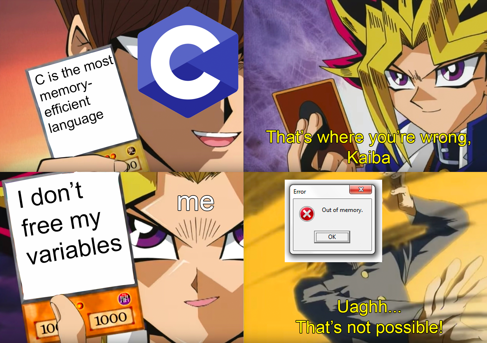

# Sprint 7

issues terminées pour le sprint 

## Jean-Noël : gestion d'un socket en C [WIP] 

**Difficultés rencontrées** 
Faire marcher le socket sur Linux ET sur Windows simultanément (gestion différente par l'OS). Beaucoup de templates de code disponibles sur internet mais pas adapté à notre projet. Phase de conversion et d'adaptation qui a été nécessaires

**Fonctionnalité** 
Permet d'envoyer un message d'un client et à un serveur en c via l'appel Scanf, et ce peut importe l'OS utilisé. 

*[TODO] => lier la fonction de socket au format du bitstream, l'envoi de données ainsi que l'envoi du dictionnaire.* 

## Hugo : packaging d'une version d'EVEEX python possible 

**Difficultés rencontrées** 
Problème d'ouverture du package, il manquait des dépendances lors de l'ouverture des fichiers. Le problème a été résolu en changement la méthode d'importation des fichier (import EVEEX.huffman au lieu de import Huffman) 

**Fonctionnalité** 
Permet la création d'un package d'une version de l'algorithme sur python. Ce package permet l'importation facile sur une machine tierce des fonctions nécessaires à l'algo, et intègre un fichier requirements.txt permettant d'installer via pip tout les paquets externes nécessaires. 

## Hugo : ajout de la compression vidéo sur l'algorithme python

**difficultés rencontrées** 
Problème de format lorsque la taille de l'image n'est pas un multiple de la taille des macro blocs. La solution a été de changer de package d'ouverture de la vidéo. 

**fonctionnalité** 
Permet la compression EVEEX d'une flux vidéo (sans son), IE de plusieurs images qui se suivent. Les performances ne sont pas temps réelles, car python ne permet pas d'aller suffisamment vite. 

## Guillaume : comprendre, utiliser et adapter le projet ENSTAB-RISCV et l'implémentation d'un SOC au sein d'un fpga 

**Difficultés rencontrés** 
Gestion de la RAM difficilement compréhensible, avec un manque de connaissance sur les différentes technologies RAM (Sram, dram) et leur implémentation hardware au sein du FPGA. La compéhension du makefile ainsi que du linker a pris quelques heures également. 

**Fonctionnalité** 
Permet d’intégrer au sein d'un fpga un SOC riscv, ainsi qu'un firmware disposant de plusieurs fonctions de test du matériel. le SOC est contrôlable depuis un terminal Linux et dispose d'assez de RAM pour exécuter un code simple (16ko).

## Hussein : Implémentation de la DCT / DCT inverse en C

**Difficultés rencontrés** 
Application de la DCT sur une image, et non sur une matrice. Quelques problèmes pour la prise en compte de la taille des matrices (qui pourra être potentiellement variable dans le futur. 

**Fonctionnalité** 
Permet la transformation DCT d'une matrice de taille N, ainsi que la DCT inverse. Elle intervient dans le chaine de compression. 

*[TODO] => gérer la transformation DCT / inverse sur une image/macro bloc* 

## Alexandre : Encodage de Huffman et création de types non natifs en C

**difficultés rencontrées** 
Grosses fuites de mémoires, une journée complète pour tracker toutes les fuites par valgrind, ainsi que les corruptions. 
Maintenant les types non natifs sont implémentés et ne génère pas de fuite/corruption de mémoire.

**fonctionnalité** 
Encoder une chaîne de caractère selon la méthode de l'arbre binaire de Huffman, et retourne un dictionnaire d'encodage avec pour chaque symbole son encodage binaire.

# Suite de l'activité pour le sprint 8 (pour l'instant)

- finir le socket en C (l'incorporer au projet)
- support des images par la transformation DCT
- Changement de SOC pour passer sur un fonctionnement VeriscV + linux basé buildroot
- encodage d'un dictionnaire de Huffman basé sur plusieurs frames (moyenne) en python. 

A plus long terme (visée sprint 9) : 

- gestion de l'interpolation d'image en python 
- Faire la chaîne d'encodage en entier en C 
- préparer un SOC avec le support d'une camera I2C et de mémoire DDRAM
- découpage en macroblocs dynamiques 

