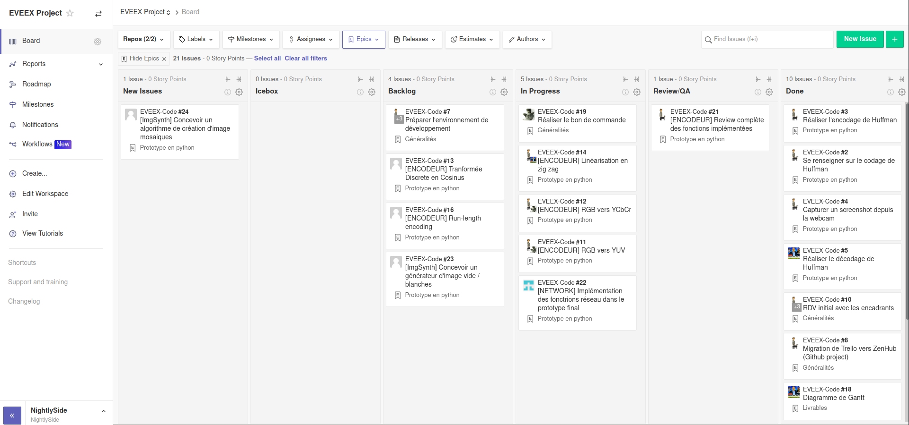

# Compte rendu de séance projet
> Date du 22 septembre 2020  
> Début de séance à 8h15  
> Fin de séance à 16h05

## Livrables

Il était attendu pour aujourd'hui deux livrables : un **diagramme de Gantt** ainsi que le **compte rendu d'interview** avec nos encadrants.

Hugo s'est chargé de concevoir un diagramme de Gantt avec le software "**GanttProject**" puis en ajustant la charge des différentes tâches ainsi que la répartition de ces tâches sur chaque membres de l'équipe afin d'optimiser la répartition du travail.

A partir des notes et de l'enregistrement audio que nous avons fait lors de l'**interview** du 9 septembre avec nos encadrants, Guillaume a rédigé le compte rendu d'interview en y intégrant des schémas en SVG réalisés avec [draw.io](https://app.diagrams.net/) (extension pour VS Code).

Guillaume est parti à 11h pour un rendez-vous agilité avec Joël Champeau puis a réalisé dans l'après midi le bon de commande pour l'achat des caméras compatibles FPGA, pour finalement l'acheter par ses propres moyens sur aliexpress.

## Généralités

Nous avons profité d'un début de séance en présentiel pour **faire le point** sur ce qu'on avait fait la semaine dernière mais surtout sur ce que nous devions changer suite à l'entretient avec nos encadrants. Nous avons fini de préparer l'**environnement de développement** sur chacune de nos machines personnelles.

Alexandre s'est chargé de **migrer le backlog** depuis [Trello](https://trello.com/) vers [ZenHub](https://www.zenhub.com/) qui fonctionne en étroite collaboration avec **Github**. Ce qui à motivé ce changement c'est l'unicité d'écosystème de nos outils (un seul compte pour github et zenhub), une meilleure gestion du mode Agile sur ZenHub et enfin la possibilité de pouvoir relier des "commits" ou des morceaux de code avec les différentes tâches du backlog.

Il en a profité pour changer les spécifications du backlog et de réassigner les tâches en fonction de l'appétence des membres du groupe.

## Le prototype python

Alexandre a réalisé un **squelette de prototype** final en python en documentant les fonctions nécessaires à la réalisation du prototype. Il a de plus implémenté la DCT (discrete cosine transform) et les fonctions de conversion RGB -> YUV/YCbCr.

Hugo s'est chargé de commencer à **implémenter les fonctions** de quantifications, de scan en zig zag et le run length encoding.

Jean-Noël a conçut le **prototype de connexion réseau** entre deux entités pour échanger des bitstreams et s'est chargé d'implémenter son code dans le prototype final. Il est actuellement capable de se connecter un client à un serveur et d'échanger des paquets TCP.

On a ajouté une image de test en 10x10 pixels qui nous servira de base pour vérifier l'encodage et le décodage.

> Le code et l'avancement du projet sont disponibles sur le [repo Github](https://github.com/EVEEX-Project/EVEEX-Code).